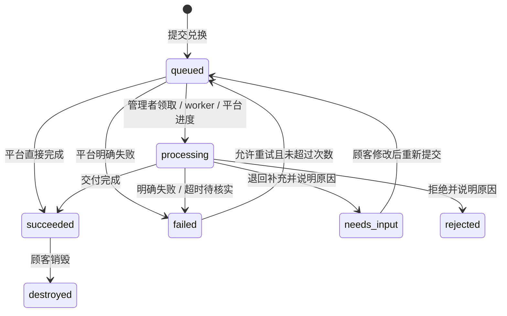

# 协议 v1

所有 JSON 使用 UTF-8。API 错误为 `{"detail":"说明"}`，HTTP 400/422 是输入错误，401/403 是认证或权限，404 是不存在，409 是状态冲突，410 是凭证、卡密或领取已失效，408 是上传超时，413 是上传大小或数量超限，429 是限流，507 是服务器文件存储额度或磁盘空间不足。外部平台不访问商家会话接口。

## 任务状态



任务 ID 在失败重试或退回补充后保持不变，`attempt` 从 1 递增。平台必须以稳定任务 ID 去重外部交付，以 `(task_id, attempt)` 区分状态回调。旧尝试的回调 HTTP 409。终态不能覆盖；外部回调重复报告相同的成功或失败终态时返回当前结果，不修改内容。有步骤计划时，进度由已完成步骤计算，处理中最高 99%，成功强制为 100%；没有步骤计划时保留原来的百分比接口，处理中进度不能倒退。

商品规则 `allow_retry`、`max_attempts` 与失败结果 `retryable` 必须同时满足，才能重试。没有确认未交付的失败不能标记为可重试。Webhook 或队列超过 1 小时未更新，以及自动处理器中断，都会进入不可自动重试的失败状态；商家在核实后可放行。过期尝试的待投递 `redemption.requested` 会取消，不继续启动旧任务。

队列审核另有两种结果，均要求说明原因：`needs_input` 让顾客补充或修改资料，卡密回到 `ready`；它不是发货失败，不受 `allow_retry` 或 `max_attempts` 限制。顾客重新提交时沿用任务的输入输出、规格和步骤快照，增加 `attempt`，重置进度和已完成步骤。卡密过期或撤销后仍不能提交。`rejected` 为拒绝终态，卡密同时变为 `rejected`，不能重新兑换或领取内容；已有领取链接仍可查看拒绝原因。

## 支付平台生成卡密

在 SSH 终端执行 `uv run python -m extore.cli integration-key`。命令生成或轮换仅能发行卡密的 API Key，只显示一次；与商品 Webhook 密钥无关。

```http
POST /api/integrations/cards
Authorization: Bearer <API-Key>
Idempotency-Key: payment-order-unique-id
Content-Type: application/json

{"product_id":"商品 UUID","count":1}
```

响应 `{"codes":["XXXXXXXX-XXXXXXXX-XXXXXXXX-XXXXXXXX"]}`。数量 1–1000。幂等键长 8–200 字符。同键同请求返回原卡密，不再生成；同键不同请求 HTTP 409。响应加密持久化用于平台恢复，密钥位于 `EXTORE_DATA/issuance.key`；该接口持钥者可读取同幂等键原响应，不向顾客暴露该密钥。幂等记录永久保留，防止旧订单重新发行。轮换平台 Key 不清理记录。

发行请求也可传 `label` 批次名称（最多 100 字符）和 `expires`（未来的 Unix 秒，省略或 `null` 表示不到期）。它们同样参与幂等请求匹配；已有未带这些字段的请求保持兼容。

`variant_id` 指定本商品的规格，省略等同于 `"default"`。非默认规格参与幂等匹配；省略与显式默认规格保留旧请求的匹配方式。不存在的规格返回 400，已停用规格的新发行返回 409；已经成功的幂等请求仍返回原响应，不因后来停用而重新制卡。每张卡密保存发行时的规格快照，不能由顾客在兑换时换规格。

平台须持久化订单与请求幂等键，收到响应后再向顾客交付卡密。没有付款回调或支付逻辑。

## 卡密库存与统计

商家可使用 `/api/admin` 或 `/api/manage` 下的查询接口查看全店或指定商品；商品管理链接使用 `/api/manage`，需要 `cards.manage`，且始终限定自己的商品。与其他商品管理接口不同，这些统计查询允许商家省略 `product_id` 查看全店。

| 接口 | 查询参数 | 结果 |
|---|---|---|
| `GET /api/manage/card-stats` | 可选 `product_id` | `{summary,products}`，总计与每个商品统计 |
| `GET /api/manage/card-inventory` | `product_id,variant_id,status,batch_id,search,offset,limit` | `{items,total,summary,offset,limit}`，过滤库存与全范围统计 |
| `GET /api/manage/cards/{id}/history` | 可选 `product_id` | `{card,timeline}`，单张卡密状态与处理时间线 |

三个查询均有对应 `/api/admin/...` 接口。库存 `offset` 从 0 开始，`limit` 为 1–500；`search` 只匹配内部卡密 ID 或末 6 位。列表保留批次 ID 与名称、到期时间、首次验码时间、任务状态、尝试次数及领取记录，不返回完整卡密或摘要。旧卡没有可恢复的尾号时，`code_suffix` 为 `null`；尾号不保证唯一，内部 ID 才用于精确定位。

库存 `state` 保留原卡密生命周期值 `ready`、`reserved`、`used`、`rejected` 或 `revoked`；`status` 是结合任务与到期信息计算的展示状态，用于筛选。旧卡的批次、尾号与首次验码不会凭空回填；新验码记录从启用跟踪后开始，已有任务与领取记录仍计入统计。

库存项带 `variant_id` 与发行时的 `variant_name`。统计商品中的 `variants` 数组按规格列出 `variant_id`、名称、描述、参考价格、币种、启用状态及 `summary`；指定商品时也返回该商品规格统计。旧卡计入默认规格，停用或历史规格仍计入商品总数。

统计口径：

| 字段 | 含义 |
|---|---|
| `total` | 已发行总数 |
| `remaining` | 未到期、未撤销的 `unused` 加 `needs_input`；退回补充计回剩余 |
| `available` | `remaining` 加符合重试条件的失败卡密；已有任务的卡密仍归原顾客使用 |
| `used` | 已有任务且任务不处于 `needs_input` 的卡密数；退回补充会减回，重提后计入 |
| `verified` | 已记录至少一次成功验码的卡密数 |
| `viewed` | 至少领取过一次内容的卡密数 |
| `in_progress` | 排队或处理中的卡密数 |
| `completed` | 已成功或已销毁的卡密数 |
| `failed` | 当前失败任务的卡密数，不含退回补充或拒绝 |
| `rejected` | 已拒绝的卡密数，计入 `used`，不计入剩余、失败或完成 |

`summary.states` 的状态互斥：`unused`、`needs_input`、`queued`、`processing`、`succeeded`、`failed_retryable`、`failed_terminal`、`destroyed`、`revoked`、`expired`、`rejected`，可作为库存 `status` 筛选值。库存响应的 `summary` 始终统计整个权限范围，不随状态、批次或搜索过滤改变；`total` 是筛选后的条数。

`expired` 表示未提交或退回补充且已到期；失败任务到期后归入 `failed_terminal`。已拒绝的任务到期后仍为 `rejected`，撤销状态优先。`needs_input` 虽计回剩余，仍绑定原任务，不能当作从未使用的卡密再次销售。一次领取只增加领取记录，任务仍为 `succeeded`，不会自动变成 `destroyed`。

到期限制尚未兑换卡密的新提交、失败重试及退回补充后的重提；已经成功的交付仍按查看规则领取，到期不会销毁已有结果。历史包含发行、验码、提交、重试、进度、成功、失败、退回补充、拒绝、领取、销毁与撤销记录，不返回参数、消息、交付结果、私密领取链接、原卡密或摘要。

## 商品配置

`mode`: `manual` 表示队列，人或 AI 通过管理接口领取与处理；`webhook` 表示独立外部服务；`script` 是保留的内部代码名，表示官方白名单处理器。
`delivery`: `content` / `service`。
`view_policy`: `repeat` / `once`。
`public`: 首页是否公开显示商品。

### 商品规格

`variants` 为 1–100 个规格，代码名在本商品内唯一。例如：

```json
{
  "variants": [{
    "id": "standard",
    "name": "标准版",
    "description": "一个账户，三十天服务",
    "price": "12.50",
    "currency": "CNY",
    "attributes": {"accounts": 1, "days": 30},
    "enabled": true
  }]
}
```

`id` 匹配 `[a-z0-9][a-z0-9_-]{0,39}`；`name` 去除首尾空白后为 1–120 字符，`description` 默认为空、最多 10000 字符。`price` 是非负十进制**字符串**或 `null`，文本匹配 `[0-9]+(?:\.[0-9]{1,6})?`、最多 100 字符，规范化后最多 12 位整数；不接受指数、正负号或 JSON 数字，多余的前导零和小数尾零会规范化。`currency` 为 3–5 个大写字母，默认 `CNY`。价格只供跨平台创建商品时参考，Extore 不计算订单金额或收款。

`attributes` 最多 20 项，属性名非空、最多 100 字符，值只能是文本（最多 1000 字符）、有限数字、布尔值或 `null`；整数绝对值不得超过 `9007199254740991`，大整数用文本表示。不能嵌套数组或对象。`enabled` 默认 `true`。

未配置规格的旧商品默认采用 `{id:"default",name:"默认规格",description:"",price:null,currency:"CNY",attributes:{},enabled:true}`。旧卡缺少快照时也使用这个固定默认值，不继承后来修改的属性。发行过任意卡密的规格不能删除（409），可以停用或修改展示、价格和属性；这些修改只影响后续发行。现有卡密仍按原快照兑换，停用不会使旧卡失效。

### 输入与输出

队列商品用 `parameters` 定义顾客输入，用 `outputs` 定义交付结果。两者采用相同的字段描述，例如输入参数：

```json
{
  "key": "account_email",
  "label": {"zh-CN": "账户邮箱", "en": "Account email"},
  "type": "email",
  "required": true,
  "description": {"zh-CN": "## 查找邮箱\n1. 打开账户设置。\n2. 复制登录邮箱。"},
  "collapsed": true
}
```

输出字段示例：

```json
{
  "key": "resource_url",
  "label": {"zh-CN": "资源链接", "en": "Resource URL"},
  "type": "url",
  "required": true,
  "description": {"zh-CN": "打开链接领取你的资源。"},
  "collapsed": true
}
```

代码名匹配 `[a-z][a-z0-9_]{0,39}`，输入和输出各自唯一、各最多 30 个。类型支持 `text` / `email` / `url` / `textarea` / `number` / `file`，输入值最多 10000 字符。未知字段拒绝；服务端验证必填、邮箱、HTTP/HTTPS 链接与有限数字。`file` 的值为上传后返回的文件 ID，不能用任意字符串、路径或 URL 代替。字段名称和 Markdown 描述按当前语言展示，`collapsed` 决定教程默认折叠或展开。

内容商品必须有输出字段。省略 `outputs` 时默认一个必填的 `content` 文本字段，兼容旧商品。服务商品 `delivery="service"` 必须使用 `outputs=[]`，仅返回状态，不产生交付内容。

每个任务在首次提交时冻结自己的 `parameters` 与 `outputs`。队列商品后续可调整输入输出定义，包括新增文件字段，修改只影响尚未创建任务的卡密；已有任务的提交重试、结果校验、领取和附件均使用原定义。旧任务首次读取时补存快照，编辑商品前会先冻结尚未绑定的旧任务，避免套用新定义。

发过卡密的商品仍不能改变处理方式、交付类型、查看规则、处理器 ID 或签名密钥。Webhook 商品还不能改变输入输出的代码名、类型或必填规则，仍可改善名称、Markdown 和折叠偏好；官方处理器的字段由代码定义，不能自改。需要改变这些冻结设置时创建新商品。

### 处理步骤与联系邮箱

`progress_steps` 默认为 `[]`，最多 30 个 `{id,label}`，`id` 使用规格相同的稳定代码名格式且不能重复。`label` 为 1–20 项多语言文本，语言代码非空且最多 40 字符，每个显示名称非空且最多 200 字符。数组顺序就是展示顺序。`support_email` 默认为空字符串；非空值去除首尾空白并验证邮箱格式，最多 254 字符。

任务提交时冻结步骤计划。商品后续修改计划只影响新任务；旧任务首次读取或商品编辑前绑定一次原计划。已有空计划任务可通过下文的批处理请求明确设置一次任务专用计划。联系邮箱由商品当前配置读取，显示给需要求助的顾客。

## 官方自动处理器

处理器只能来自 [TokenNotIncluded/extore-processors](https://github.com/TokenNotIncluded/extore-processors) 的白名单目录。`processors/official` 由主仓库 Git 子模块记录固定提交，运行时按 `processor_id` 查找预设，不从任意仓库、文件路径或商家上传代码加载程序。商品的 `script` 字段为兼容保留，但必须为空。

`GET /api/admin/processors` 供商家查询预设；`GET /api/manage/processors` 需要 `product.edit`。每个预设包含 `id`、多语言名称与说明、`delivery`、`parameters`、`outputs` 和 `configuration`。商品通过 `processor_config` 填写配置；自动商品的顾客输入与交付输出必须与预设代码一致。

| `processor_id` | 商家配置 | 顾客输入 | 输出 |
|---|---|---|---|
| `resource_link` | 必填 HTTPS `resource_url`，可选 `message` | 无 | 必填资源链接、可选说明 |
| `personalized_text` | `template` 纯文本模板 | 必填 `name`，最多 200 字符 | `content` 文本 |

`resource_url` 最多 2000 字符，说明和模板最多 10000 字符。模板仅支持 `$name`、`${name}` 与 `$$` 文本替换，不执行代码。两个预设的配置均按秘密处理，顾客 API 不返回配置值。未完成配置的商品可保存为草稿，发行卡密和执行时必须满足全部必填配置。

升级官方处理器需审核源码与字段定义，再更新主仓库固定提交并发布程序包。固定的审核代码仍按 worker 用户权限运行，不提供任意恶意代码沙箱；其他自动化可以使用独立的 HTTPS 公网 Webhook 服务。

## Webhook 事件

商品配置 `webhook_url` 和 `webhook_secret`（至少 32 字符）。所有处理方式都可配置通知 URL；只有 `webhook` 处理方式接受外部状态回调。交付内容不写入事件；用户参数仅在 `redemption.requested` 携带。

```json
{
  "id": "事件 UUID",
  "type": "redemption.requested",
  "version": 1,
  "created_at": 1790000000.0,
  "product_id": "商品 UUID",
  "data": {
    "id": "任务 UUID",
    "state": "queued",
    "attempt": 1,
    "progress": 0,
    "message": "",
    "variant": {"id":"default","name":"默认规格","description":"","price":null,"currency":"CNY","attributes":{},"enabled":true},
    "steps": [{"id":"verify","label":{"zh-CN":"核实资料","en":"Verify details"},"done":false}],
    "completed_steps": [],
    "params": {"account_email": "user@example.com"}
  }
}
```

完整事件：

| type | 触发时机 | data |
|---|---|---|
| `redemption.requested` | 首次提交、合规失败重试或补充后重提 | 任务状态字段及 `params` |
| `fulfillment.progress` | 领取任务、自动处理开始、进度更新 | 任务状态字段 |
| `fulfillment.succeeded` | 首次成功交付 | 任务状态字段 |
| `fulfillment.failed` | 明确失败、超时或中断 | 任务状态字段 |
| `fulfillment.needs_input` | 已领取的队列任务退回顾客补充 | 任务状态字段，`message` 为原因 |
| `fulfillment.rejected` | 已领取的队列任务被拒绝 | 任务状态字段，`message` 为原因 |
| `delivery.viewed` | 内容成功领取，每次重复查看也产生事件 | 任务状态字段 |
| `delivery.destroyed` | 顾客首次销毁 | 任务状态字段，`state=destroyed` |

上述任务状态字段都带服务端保存的规格 `variant`、步骤快照 `steps`（每项含 `done`）与 `completed_steps`。它们是任务元数据，独立于顾客 `params`；顾客或回调不能改写规格及既有计划。事件不包含交付 `output` 或文件内容。

事件与任务变更同一 SQLite 事务提交。外部平台应快速校验、入队并返回 2xx；随后异步执行。签名字段：

```text
X-Extore-Timestamp: Unix 秒
X-Extore-Nonce: 随机字符串
X-Extore-Signature: HMAC-SHA256 十六进制
X-Extore-Event-Id: 事件 UUID
Content-Type: application/json
```

签名输入为 `timestamp + "." + nonce + "." + 原始请求体字节`，密钥为商品的 `webhook_secret`。必须对原始字节验签，不得将 JSON 重编码后验签。允许时钟误差 ±300 秒；服务器需要正确同步时间。

投递保证为**至少一次**。重试使用相同事件 ID、新时间和新 nonce。接收端需持久化事件 ID 防止重复消费；SDK 只验签，不替你存储去重状态。一次 HTTP 投递 15 秒超时，最多 8 次，间隔 `min(3600, 2^attempts * 5)` 秒。只认可 2xx，不跟随重定向。投递失败记为 `dead` 后由商家重投；过期请求记为 `cancelled`。

不同任务不保证全局顺序；顾客状态以 API 为准。超时重试可能重复到达，另一平台必须以任务 ID 做发货去重，不能只依赖事件 ID。收到了非 `redemption.requested` 的通知时不要启动发货。

## 签名回调

```http
POST /api/callbacks/<product_id>/<task_id>
X-Extore-Timestamp: ...
X-Extore-Nonce: ...
X-Extore-Signature: ...
Content-Type: application/json
```

```json
{
  "attempt": 1,
  "state": "succeeded",
  "progress": 100,
  "message": "已完成",
  "output": {"resource_url": "https://downloads.example.com/receipt"},
  "retryable": false
}
```

`state` 可为 `processing` / `succeeded` / `failed`。成功交付使用 `output` 对象，键是商品 `outputs` 的代码名，值必须为字符串。未知字段、缺少必填值或类型不符返回输入错误；所有输出值合计最多 100000 字符。文本保留格式，邮箱、数字和 URL 去除两端空白；URL 只允许不含用户名和密码的 HTTP/HTTPS 地址。

回调可传 `completed_steps`，例如 `{"state":"processing","attempt":1,"completed_steps":["verify"],"message":"资料已核实"}`。最多 30 个有效且不重复的步骤 ID，必须来自该任务快照；未知步骤返回 400，同一尝试撤回已完成步骤返回 409。省略或 `null` 保留原完成集合。带计划的任务按完成数计算进度，忽略手填百分比；完成全部步骤但仍处理中时为 99%，成功自动完成全部步骤并设为 100%。没有计划时继续使用 `progress`。实际重试开始时清空完成集合和进度，保留原计划。

旧 `content` 仅兼容只有一个 `content` 输出字段的商品。同时提供 `content` 和 `output` 时必须一致。服务商品不接受非空 `output`，兼容旧请求时忽略 `content`，只保留状态。`message` 最多 1000 字符，不能用它代替私密交付结果。

签名算法与事件相同。服务器持久化 nonce，在有效签名时间窗口内拒绝重放；相同 nonce 再到达 HTTP 409。商品不能跨商品更新任务，旧 attempt 或已销毁任务返回 409。签名不依赖浏览器 Origin 或 Cookie。

## 顾客接口

顾客浏览器的写入请求需要配置的 `Origin`，防止跨站操作。

| 接口 | 请求 | 结果 |
|---|---|---|
| `GET /api/products` | 无 | 仅公开商品及输入输出说明，无处理器秘密配置和密钥 |
| `POST /api/exchange` | `{code}` | 30 天兑换凭证、指定商品、发行规格 `variant`、已有任务 |
| `POST /api/redeem` | `{token,params}` | 创建、合规失败重试或补充后重提任务，返回状态 |
| `POST /api/receipt` | `{token}` | 商品、发行规格 `variant` 与状态；退回补充时包含原 `params` 供顾客修改，不返回交付结果 |
| `POST /api/receipt/reveal` | `{token,card_id?}` | 显式领取 `{output,content,files?}`；`content` 为兼容可读文本，一次领取原子消费 |
| `POST /api/receipt/destroy` | `{token,card_id?}` | 永久关闭应用内交付内容 |

不能根据商品 UUID 直接打开非公开商品。兑换凭证、商品管理链接和卡密都是秘密，不记录在分析工具中，不植入第三方前端脚本。状态、任务列表与事件不自动返回私密结果。一次领取会清除结构化 `output` 和兼容 `content`，附件另按每文件一次下载处理；销毁会同时清除结果及该卡密的全部输入、输出附件。销毁只关闭 Extore 内的领取，不撤销上游资源链接。

### 多张卡密共用领取链接

`POST /api/exchange` 的 `code` 可包含最多 30 张同商品卡密，用换行、空格、逗号或分号分隔，重复卡密只计一次。完整输入最多 8000 字符；原来单张卡密用空格替代连字符的格式保持兼容。原生 WebMCP 的 `extore_code_verify` 也支持同一批量输入。混入其他商品、无效或不可兑换的卡密时整批拒绝，不创建领取链接。

多张卡密响应为 `{token,batch:true,product,items}`；`POST /api/receipt` 返回相同的批量状态结构。每项包含 `card_id`、末尾 `suffix`、发行规格 `variant`、自己的 `product` 定义与已有 `job`。未提交的卡密使用当前商品输入定义，已有任务和重试使用自己的结构快照。一个链接覆盖这批卡密，有效期 30 天，不返回原卡密。

提交使用 `{token,items:[{card_id,params}]}`，每项单独填写参数；允许只提交部分卡密，整次请求在同一事务中提交或回滚。重复 `card_id` 或不属于该链接的卡密会被拒绝。领取、销毁、上传输入文件和下载交付文件均传入目标 `card_id`；未选择卡密或跨链接访问会被拒绝。单张卡密继续使用原有 `{token,params}` 请求。

## 输入与交付附件

附件工作流面向队列商品：商家在 `parameters` 或 `outputs` 中定义 `type="file"`，顾客或处理者上传后，把返回的文件 ID 放入对应字段。上传文件作为数据保存，不安装或执行代码；官方自动处理器的字段仍由审核代码定义。

| 接口 | 认证与请求 | 结果 |
|---|---|---|
| `GET /api/admin/storage` | 商家会话 | `stored_bytes,uploading_bytes,limit_bytes,disk_free_bytes,disk_reserve_bytes,active_uploads,upload_concurrency` |
| `GET /api/upload-limits` | 无认证 | `{max_file_bytes,max_card_bytes,max_card_files}`，不返回磁盘用量 |
| `POST /api/files/upload` | multipart：`token,card_id?,field_key,file` | 输入附件描述，`id` 填入 `params[field_key]` |
| `POST /api/manage/files/upload` | 管理会话，`queue.process`；multipart：`job_id,field_key,file` | 输出附件描述，`id` 填入成功请求 `output[field_key]` |
| `GET /api/manage/files?job_id=...` | 管理会话，`queue.view`，同商品 | 任务附件描述列表，不含内容或下载凭证 |
| `GET /api/manage/files/{file_id}/download` | 管理会话，`queue.view`，同商品 | 有权访问任务的附件下载，不消费顾客一次下载额度 |
| `POST /api/files/download` | JSON：`{token,file_id,card_id?}` | 已显式领取的输出附件下载 |

上传只能包含表中规定的字段和一个文件。默认单文件 20 MiB、每张卡密现存附件合计 100 MiB、最多 100 个，可通过服务器环境变量降低或调整相应额度；当前单文件最高 20 MiB。超限返回 413。输入文件必须属于这张卡密及对应输入字段；提交后不能替换，只有允许失败重试或处于退回补充时才能上传或重用输入。输出文件必须属于当前任务、尝试和对应输出字段，只有领取了该队列任务的处理者可上传。成功提交后绑定所选附件，未选草稿会清理；新尝试删除旧输出，保留可重用输入直到重新绑定。

全站附件逻辑容量默认 5 GiB，计入保留的 BLOB 与正在接收的实际文件字节；同时最多 4 个上传，单次接收期限 5 分钟，实际磁盘至少保留 512 MiB 并另留写入空间。额度或磁盘不足返回 507，并发超限返回 429，接收超时返回 408。临时文件与数据库位于同一受检查的文件系统；所有容量和期限配置见[运行指南](getting-started.md#文件上传与存储)。

未绑定草稿默认 24 小时到期，由 worker 分轮清理；当前处理中尝试的输出草稿与已经绑定的附件不会因年龄被删。每 60 秒维护一轮，最多清理 100 条、20 MiB，并在清理事务后以 100 毫秒等待尝试截断 WAL；活跃读者或锁冲突时下轮重试。删除释放逻辑额度，SQLite BLOB 所在页可复用，数据库文件本身不自动缩小。

`reveal` 只释放本次结果实际引用的输出附件，返回文件描述（含 `id,field_key,filename,content_type,size` 等）。顾客下载还必须提交有效兑换凭证；文件 ID 本身没有下载权限。凭证只放在 POST JSON 或 multipart 请求体，不能拼成 GET 下载链接或 URL 查询参数。管理者 GET 下载依赖其 HttpOnly 会话，不使用顾客凭证。

`repeat` 允许重复下载；`once` 的每个文件第一次下载在事务内清除文件内容，第二次返回 410，多文件各有独立的一次额度。应先保存 `reveal` 返回的文件 ID，再逐个下载；再次 `reveal` 不能恢复已消费的结果或附件。销毁删除该卡密全部附件，包括顾客上传的输入。下载按附件返回，不以内联网页方式渲染上传内容。

## 商家接口

商家完整接口可在 `/docs` 查看。认证 Cookie HttpOnly、SameSite=Strict、生产 Secure；写操作校验 Origin。

商家可创建与维护商品、批量制卡、撤销未兑换卡密、维护商品管理链接、查看与重投事件，以及管理多个 Passkey。第一次注册 Passkey 后密码登录禁用；添加或移除 Passkey 需要最近 10 分钟内登录，最后一个 Passkey 不能从网页删除。全部遗失时通过 SSH 的 `reset-auth` 命令恢复。

`GET /api/admin/product-templates` 返回队列内容交付与队列服务模板。`POST /api/admin/products/quick` 接受 `{template_id,name?,from_product_id?}`：`template_id` 为 `manual_content`、`manual_service` 或 `existing_product`，复制已有商品时必须提供 `from_product_id`。响应 `{product,management_link}` 创建非公开商品及有效 7 天的配置链接，权限仅为 `product.edit` 与 `fulfillment.configure`，可交给 AI 或其他配置管理者。复制商品会更换签名密钥并移除原处理器秘密配置，不复制源商品的发货凭证。

## 商品管理链接

一个链接只授权一个商品。店长、处理人员等名称用于区分管理者，权限由链接的 `permissions` 决定。最大权限是该商品的全部管理权限，不包括创建其他商品、全店设置、支付平台 Key、商家认证或 Passkey 管理。

| 权限 | 允许的操作 |
|---|---|
| `queue.view` | 查看该商品任务、参数和处理进度 |
| `queue.process` | 人或 AI 领取队列任务，更新、完成、标记失败、退回补充或拒绝自己领取的任务；须同时有 `queue.view` |
| `queue.retry` | 核实失败任务后放行重试；须同时有 `queue.view` |
| `product.edit` | 查看与编辑商品展示信息和顾客参数；单独授予时不能读取签名密钥或更改发货、查看与重试规则 |
| `fulfillment.configure` | 读取与配置该商品发货方式、输出结构、查看与重试规则、官方处理器和签名密钥；须同时有 `product.edit` |
| `cards.manage` | 为该商品生成卡密、查看卡密状态、撤销未兑换卡密 |
| `events.manage` | 查看与重投该商品事件 |
| `links.delegate` | 为该商品生成更小权限的链接，查看与撤销自己的后代链接 |

全部八项权限用于店长管理指定商品。默认权限和升级前已有链接的权限为 `["queue.view","queue.process"]`，不会自动扩大。未知权限、空权限列表、处理或重试权限缺少 `queue.view`，以及自动发货配置权限缺少 `product.edit`，都返回 422。

`fulfillment.configure` 可以读取 Webhook 签名密钥。对于采用 Webhook 处理的商品，持有该密钥可以向系统提交该商品的签名回调。因此，此权限具有控制该商品外部发货的能力，不能只因为需要编辑商品展示就授予。队列操作仍单独校验 `queue.process` 与 `queue.retry`。

持有 `links.delegate` 的管理者可以创建子链接，限制如下：

- 商品必须与父链接相同。
- 子链接权限必须是父链接权限的**严格子集**，不能相同或增加。是否允许子链接继续委派，由是否保留 `links.delegate` 决定。
- 有效期不能超过父链接或任何祖先。父链接撤销或过期时，所有后代都失效，已登录会话也不能继续操作。
- 管理者只能查看和撤销自己的后代，不能撤销父链接或其他分支。撤销会级联撤销后代，并把它们尚在处理的任务放回原商品队列。

登录使用链接片段中的凭证提交 `POST /api/staff/login`，请求为 `{token}`。`/staff`、`/api/admin/staff` 和认证角色 `staff` 为兼容保留，界面统一称为商品管理链接。原始链接只在创建时返回，列表不包含凭证或数据库摘要。

`GET /api/auth/status` 的链接会话返回 `role="staff"`、`product_id`、`permissions`、`link_id`、`link_name`、`link_expires`、`parent_id`、`max_uses`、`uses`、`remaining_uses`、`max_cli_uses`、`cli_uses` 与 `remaining_cli_uses`。`link_expires` 是当前链接与全部祖先中最早的到期时间，使用 Unix 秒。权限与祖先有效性在每次操作时重新校验，不能只信任前端缓存的认证状态。

商家创建店长链接：

```http
POST /api/manage/links
Content-Type: application/json

{
  "product_id": "商品 UUID",
  "name": "店长",
  "days": 7,
  "permissions": ["queue.view", "queue.process", "queue.retry", "product.edit", "fulfillment.configure", "cards.manage", "events.manage", "links.delegate"]
}
```

店长使用同一接口生成处理人员链接，商品可省略，由当前链接确定：

```json
{"name":"资料处理","days":1,"permissions":["queue.view","queue.process"]}
```

`name` 长 1–100 字符；`days` 为大于 0、最多 90 的天数，可使用小数。商家省略 `days` 时有效 7 天；下级省略时为 7 天与父链接剩余有效期的较短者。显式期限超过父链接、权限相同或扩大，均返回 403。`permissions` 省略时使用默认的队列查看与处理权限，重复权限会去重。`max_uses` 是浏览器新登录额度，`max_cli_uses` 是新 CLI 设备绑定额度，均为 1–1000 的整数、默认 1；两项独立计数，子链接分别不能超过父链接配置的上限。

一次浏览器额度用于创建一个新的成功浏览器登录会话，事务内计数，耗尽后新登录返回 409。同一个有效会话重复提交同一链接不会再扣次数；耗尽不会自动注销已有会话，权限仍受链接期限和撤销约束。获取 `/staff#...` 页面或读取认证状态不消费额度，登录需要明确提交 `POST /api/staff/login`。更换浏览器、退出后重新登录等新会话需要剩余额度。

创建响应包含 `id`、`product_id`、`name`、`permissions`、`parent_id`、`created`、`expires`、`revoked`、`max_uses`、`uses`、`remaining_uses`、`max_cli_uses`、`cli_uses`、`remaining_cli_uses` 和一次性返回的 `url`。列表省略 `url`。撤销返回 `{ok:true,revoked_count}`，数量包括被撤销的链接及后代。商家兼容接口 `POST /api/admin/staff` 使用相同创建字段，但 `product_id` 必填；`GET /api/admin/staff` 查看全店管理链接，`POST /api/admin/staff/{id}/revoke` 撤销指定分支。

## 按商品管理接口

以下接口同时供商家和商品管理链接使用。GET、PUT 与路径撤销/重投接口用查询参数 `product_id` 选择商品：商家必须指定，链接持有人可省略并默认自己的商品；指定其他商品返回 403。`GET /api/manage/products` 返回最小商品概要，不需要队列查看权限。

| 接口 | 权限 | 请求与结果 |
|---|---|---|
| `GET /api/manage/products` | 有效管理会话 | 授权商品概要、规格、当前输入输出、步骤计划与联系邮箱 |
| `GET /api/manage/processors` | `product.edit` | 官方处理器预设与其代码定义的输入输出、配置项 |
| `GET /api/manage/product` | `product.edit` | 当前商品配置；没有 `fulfillment.configure` 时签名密钥与处理器秘密配置隐藏 |
| `PUT /api/manage/product` | `product.edit` | JSON 为商品配置；`product_id` 在查询参数，不放入 JSON；发货配置还需 `fulfillment.configure`，响应按 GET 的规则隐藏密钥 |
| `GET /api/manage/cards` | `cards.manage` | 卡密 ID、商品、状态与创建时间；不返回原卡密或摘要 |
| `POST /api/manage/cards` | `cards.manage` | `{product_id,count,variant_id?,label?,expires?}`；商品必填，数量 1–1000，默认 1；返回 `{codes,batch_id}` |
| `POST /api/manage/cards/{id}/revoke` | `cards.manage` | 仅撤销当前商品尚未兑换的卡密 |
| `GET /api/manage/events` | `events.manage` | 当前商品的事件及投递状态，不含完整参数、内容或签名密钥 |
| `POST /api/manage/events/{id}/retry` | `events.manage` | 仅重投当前商品 `dead` 的事件 |
| `GET /api/manage/links` | `links.delegate` | 商家查看当前商品全部链接；管理者只查看自己的后代 |
| `POST /api/manage/links` | `links.delegate` | `{product_id?,name,days?,permissions?,max_uses?,max_cli_uses?}`；创建同商品的更小权限链接 |
| `POST /api/manage/links/{id}/revoke` | `links.delegate` | 级联撤销当前商品内有权管理的链接分支 |

商品更新时，`webhook_secret` 留空表示保留原值，合并后再验证完整配置。没有 `fulfillment.configure` 的管理者提交隐藏的空处理器配置时保留原值，不能更改 `mode`、`delivery`、`view_policy`、`script`、`webhook_url`、`webhook_secret`、`allow_retry`、`max_attempts`、`processor_id`、`processor_config` 或输出字段结构，修改返回 403。拥有此权限仍受前文的已发卡冻结与官方预设限制。商品管理链接不能安装程序、创建新商品或调用全店 `/api/admin/*` 接口。

商家 `POST /api/admin/cards` 同样返回 `{codes,batch_id}`，用于定位本次发行的批次；支付平台制卡接口保持 `{codes}` 响应。

## CLI 设备授权

CLI 使用 Ed25519 设备密钥，与浏览器 Cookie 会话分开。一个设备授权仍只有一个商品管理链接的权限；多个商品的聚合只在客户端完成。安装和命令用法见 [CLI 文档](cli.md)。

| 接口 | 认证与请求 | 结果 |
| --- | --- | --- |
| `POST /api/cli/authorize` | 无 Cookie / Bearer；`{token,public_key,client_name,signature}` | 绑定设备，返回 `device_id,product_id,client_name,fingerprint,permissions,expires,already_authorized,max_cli_uses,cli_uses,remaining_cli_uses` |
| `POST /api/cli/challenge` | 无 Cookie / Bearer；`{device_id}` | `challenge_id,challenge,expires,expires_in`，最多有效 5 分钟 |
| `POST /api/cli/session` | 无 Cookie / Bearer；`{device_id,challenge_id,signature}` | `access_token,token_type,expires,expires_in,device_id,session_id,product_id,permissions` |
| `GET /api/cli/status` | CLI Bearer | 当前商品、链接、设备、会话与独立额度元数据，不返回凭据 |
| `DELETE /api/cli/session` | CLI Bearer | 退出当前会话，保留设备授权 |
| `POST /api/manage/cli-ticket` | 商家或商品管理会话；`{staff_id?}` | `token,origin,expires,expires_in,staff_id,product_id`，用于短期 CLI 绑定 |
| `GET /api/admin/cli-devices` | 商家会话 | 全店设备安全元数据 |
| `GET /api/manage/cli-devices` | 商品管理会话 | 自己及有权管理的下级设备 |
| `DELETE /api/admin/cli-devices/{id}` | 商家会话 | 撤销设备及其 CLI 会话 |
| `DELETE /api/manage/cli-devices/{id}` | 商品管理会话，服务端限定链接范围 | 撤销有权管理的设备及其会话 |

`public_key` 是 32 字节 Ed25519 公钥的无填充 base64url（43 字符），`signature` 是 64 字节签名的同种编码（86 字符）。`client_name` 为去除首尾空白后 1–100 字符的设备名称。`token` 由官方客户端提交完整 `/staff#…` 管理链接或 `/cli#…` 专用票据链接。绑定签名使用 UTF-8，字段之间为单个换行，末尾没有换行：

```text
extore-cli-bind-v1
EXTORE_ORIGIN
token（与请求字段完全一致）
public_key
```

服务器先验签再消耗 CLI 绑定额度；同链接、同公钥重复绑定返回同一个设备，不再次扣减。CLI 额度耗尽不终止已绑定设备。私钥丢失后新设备需要剩余额度或新管理链接，撤销设备不会自动退还已用额度。

续签同样以 UTF-8 签名下列文本：

```text
extore-cli-session-v1
EXTORE_ORIGIN
device_id
challenge_id
challenge
```

挑战只可成功消费一次。Bearer 有效期为 8 小时与链接及祖先剩余有效期的较短者；每次请求重新检查设备、链接、祖先和权限。可用设备通过新挑战续签，不再次消耗管理链接额度。CLI Bearer 用于 `/api/cli/status`、退出及获授权的 `/api/manage/*` 操作，不授予全店 `/api/admin/*` 权限，也不混用浏览器 Cookie。

CLI 专用票据最多有效 5 分钟，不能超过授权剩余期限。商家生成时指定目标 `staff_id`；商品管理会话只能为自己的链接生成，不能借此给其他链接授权。票据首次绑定消耗 CLI 额度，不消费浏览器额度；只能绑定一个公钥，已绑定公钥的重复请求可在有效期内恢复响应。票据不能用于 `POST /api/staff/login`。网页把该票据与操作范围组成机器人接入提示词，只在明确生成时显示，不提供历史明文查询。

设备列表包含不透明 ID、链接/商品名称及 ID、设备名称、公钥指纹、创建/最近活动、撤销与有效标记；不返回私钥、票据或 Bearer。设备撤销同时结束该设备会话；链接及祖先撤销或过期会阻止设备访问和续签。单纯退出或撤销一条会话不等于撤销设备授权。

### 登录会话与审计

`GET /api/admin/sessions` 返回全店登录会话；`DELETE /api/admin/sessions/{id}` 撤销指定会话。商品管理链接使用 `/api/manage/sessions` 与 `/api/manage/sessions/{id}`，默认只查看与撤销本链接的会话；有 `links.delegate` 时包含同商品内自己的后代，不包含其他分支或商家会话。

会话字段包括不透明 `id`、角色、`channel`（browser / cli）、`device_id`、`client_name`、商品与链接名称、创建/最后访问/到期时间、`active`、`revoked`、`current`、IP 和 User-Agent，不返回 Cookie、凭证或摘要。撤销最后一个有效链接会话时，其未完成队列任务放回原商品队列并保留已有步骤、文件和参数。`GET /api/admin/audit` 与 `GET /api/manage/audit` 查看对应范围的链接和会话审计，`limit` 为 1–200；记录会话创建、替换、退出、撤销、分渠道链接消费、CLI 票据生成及设备创建/撤销等动作，不记录原始秘密凭证。

## 商品队列

队列按商品分开。`GET /api/manage/products` 返回有权管理的商品概要；商品管理链接只得到授权商品。商家查询 `GET /api/manage/jobs?product_id=<商品 UUID>` 必须指定商品，链接持有人可省略并默认使用授权商品；查看队列需要 `queue.view`。默认任务列表包含各任务冻结的输入输出定义、规格、步骤及安全附件描述，不应使用商品当前表单去填写旧任务结果。`compact=true` 改为摘要列表，不返回顾客参数或输入输出结构，只带状态、进度、规格、步骤和附件数量/容量等处理元数据；CLI 的 queues/jobs 使用此视图。需要资料时通过 `job_id` 精确读取任务详情，省略 compact 或使用 compact=false。

队列默认 `view=active`，返回排队、处理中、失败待核实与退回补充的任务。`view=processed` 返回已完成、已销毁与已拒绝任务，`view=all` 返回全部历史；记录保留，切换视图不会删除任务。显式 `state` 优先按指定状态查询；通过 `job_id` 精确定位时可读取历史任务，商品权限限制保持不变。网页和原生 WebMCP 的默认列表都省略已处理任务，避免重复传递历史参数。

`queue_ahead` 统计同商品中排序在本任务前的 `queued` 与 `processing` 任务，顺序为 `(created,id)`。活跃任务的 `queue_position=queue_ahead+1`，终态为 0；其他商品不影响排位。这是当前队列位置，不估算完成时间。顾客状态同时返回 `steps=[{id,label,done}]`、`completed_steps`、`message`、`support_email` 与 `variant`。

`POST /api/manage/batch`：

```json
{"product_id":"商品 UUID","ids":["任务 UUID"],"action":"progress","completed_steps":["verify"],"message":"资料审核完成，正在准备交付"}
```

`action`: `claim` / `progress` / `succeed` / `fail` / `retry` / `request_changes` / `reject`。`product_id` 必填，一次最多 100 个同商品任务，混入其他商品返回 403 且整批回滚。整批事务要么成功、要么回滚。`claim`、`progress`、`succeed`、`fail`、`request_changes` 与 `reject` 需要 `queue.process`；领取只接受排队任务，进度、完成、失败、退回补充和拒绝只接受当前管理者自己领取的 `processing` 队列任务。人和 AI 使用相同接口与权限。`retry` 需要 `queue.retry`，核实后允许失败任务由顾客再次提交。官方处理器和 Webhook 任务不能由队列接口覆盖交付。

`completed_steps` 是该尝试目前完成的完整集合，省略保留原值；不能提交未知或重复 ID，也不能撤回已完成步骤。顺序由任务计划统一规范化，进度按完成数量计算；`succeed` 自动完成全部步骤。没有计划时可继续传 `progress`（0–99）。`message` 持久化显示给顾客，最多 1000 字符，适合说明当前完成的工作。

队列中或处理中的任务若计划为空且没有完成步骤，可在 `claim`、`progress`、`succeed` 或 `fail` 同次请求传 `progress_steps`（1–30 项，与商品步骤格式相同），明确绑定一次任务专用计划；已有非空计划不能替换。该操作仍需 `queue.process`，不会改变商品或其他任务的计划。

`request_changes` 与 `reject` 必须传非空白、最多 1000 字符的 `message` 作为顾客可见原因，不能同时交付 `content` 或 `output`。退回补充释放领取者、清除旧输出，保留输入供顾客修改；拒绝同时禁用卡密。两者都不同于真正发货失败。

```json
{"product_id":"商品 UUID","ids":["任务 UUID"],"action":"request_changes","message":"请补充账户邮箱截图，再提交一次。"}
```

`retry` 只放行失败重试，不创建新尝试，也不接受 `completed_steps` 或 `progress_steps`（422）。顾客实际重新提交时才增加 `attempt`、清空完成集合及进度，并保留原计划和输入输出快照。

完成使用 `action="succeed"` 与符合商品输出结构的 `output`：

```json
{"product_id":"商品 UUID","ids":["任务 UUID"],"action":"succeed","output":{"resource_url":"https://downloads.example.com/receipt"},"message":"已完成"}
```

同一批任务使用同一组结果与完成步骤；各任务均独立校验自己的快照，需要分别交付不同结果时分别提交。文件输出 ID 绑定单个任务，通常必须逐任务上传和完成。服务商品完成不提供输出内容。

管理事件列表不返回完整参数和交付内容；原始 `redemption.requested` 事件按前文携带参数。审计记录保存操作者、动作、目标及时间。敏感内容的完整备份、保留期和外部平台删除策略需由商家制定。
