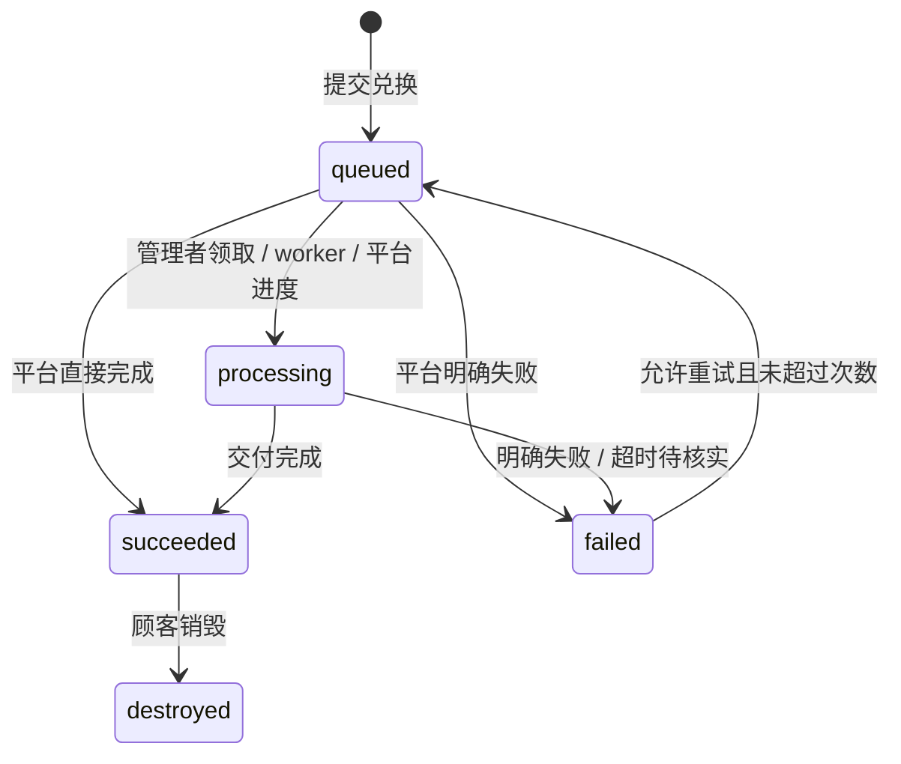

# 协议 v1

所有 JSON 使用 UTF-8。API 错误为 `{"detail":"说明"}`，HTTP 400/422 是输入错误，401/403 是认证或权限，404 是不存在，409 是状态冲突，410 是领取已失效，429 是限流。外部平台不访问商家会话接口。

## 任务状态



任务 ID 在重试时保持不变，`attempt` 从 1 递增。平台必须以稳定任务 ID 去重外部交付，以 `(task_id, attempt)` 区分状态回调。旧尝试的回调 HTTP 409。终态不能覆盖；同一终态的重复完成请求返回当前结果，不修改内容。只接受 0–100 的进度；处理中进度不能倒退，成功强制为 100。

商品规则 `allow_retry`、`max_attempts` 与失败结果 `retryable` 必须同时满足，才能自动重试。没有确认未交付的失败不能标记为可重试。Webhook 超过 1 小时未更新状态，人工超过 1 小时未更新进度，以及脚本中断，都会进入不可自动重试的失败状态；商家在核实后可放行。过期尝试的待投递 `redemption.requested` 会取消，不继续启动旧任务。

## 支付平台生成卡密

在 SSH 终端执行 `uv run python -m extore.cli integration-key`。命令生成或轮换仅能发行卡密的 API Key，只显示一次；与商品 Webhook 密钥无关。

```http
POST /api/integrations/cards
Authorization: Bearer <API-Key>
Idempotency-Key: payment-order-unique-id
Content-Type: application/json

{"product_id":"商品 UUID","count":1}
```

响应 `{"codes":["XXXXXXXX-XXXXXXXX-XXXXXXXX-XXXXXXXX"]}`。数量 1–1000。幂等键长 8–200 字符。同键同请求返回原卡密，不再生成；同键不同请求 HTTP 409。响应加密持久化用于平台恢复，密钥位于 `EXTORE_DATA/issuance.key`；该接口持钥者可读取同幂等键原响应，不向顾客暴露该密钥。幂等记录永久保留，防止旧订单重新发行。轮换平台 Key 不清理记录。

平台须持久化订单与请求幂等键，收到响应后再向顾客交付卡密。没有付款回调或支付逻辑。

## 商品配置

`mode`: `manual` / `webhook` / `script`。
`delivery`: `content` / `service`。
`view_policy`: `repeat` / `once`。
`public`: 首页是否公开显示商品。

每个参数包含：

```json
{
  "key": "account_email",
  "label": {"zh-CN": "账户邮箱", "en": "Account email"},
  "type": "email",
  "required": true,
  "description": {"zh-CN": "## 查找邮箱\n1. 打开账户设置。\n2. 复制登录邮箱。"},
  "collapsed": true
}
```

代码名匹配 `[a-z][a-z0-9_]{0,39}`，必须唯一。类型支持 `text` / `email` / `textarea` / `number`，参数最多 30 个，值最多 10000 字符，未知参数拒绝。前端展示多语言名称和 Markdown 教程，服务端验证必填、邮箱与有限数字。

发过卡密的商品不能改变处理方式、交付类型、查看规则、脚本或签名密钥。需要改这些设置时创建新商品，避免已经发行的卡密与正在处理的任务改变含义。名称、说明、参数等可调整，建议无待处理任务时更改参数结构。

## Webhook 事件

商品配置 `webhook_url` 和 `webhook_secret`（至少 32 字符）。所有处理方式都可配置通知 URL；只有 `webhook` 处理方式接受外部状态回调。交付内容不写入事件；用户参数仅在 `redemption.requested` 携带。

```json
{
  "id": "事件 UUID",
  "type": "redemption.requested",
  "version": 1,
  "created_at": 1790000000.0,
  "product_id": "商品 UUID",
  "data": {
    "id": "任务 UUID",
    "state": "queued",
    "attempt": 1,
    "progress": 0,
    "message": "",
    "params": {"account_email": "user@example.com"}
  }
}
```

完整事件：

| type | 触发时机 | data |
|---|---|---|
| `redemption.requested` | 首次提交或合规重试 | 任务状态字段及 `params` |
| `fulfillment.progress` | 领取任务、自动处理开始、进度更新 | 任务状态字段 |
| `fulfillment.succeeded` | 首次成功交付 | 任务状态字段 |
| `fulfillment.failed` | 明确失败、超时或中断 | 任务状态字段 |
| `delivery.viewed` | 内容成功领取，每次重复查看也产生事件 | 任务状态字段 |
| `delivery.destroyed` | 顾客首次销毁 | 任务状态字段，`state=destroyed` |

事件与任务变更同一 SQLite 事务提交。外部平台应快速校验、入队并返回 2xx；随后异步执行。签名字段：

```text
X-Extore-Timestamp: Unix 秒
X-Extore-Nonce: 随机字符串
X-Extore-Signature: HMAC-SHA256 十六进制
X-Extore-Event-Id: 事件 UUID
Content-Type: application/json
```

签名输入为 `timestamp + "." + nonce + "." + 原始请求体字节`，密钥为商品的 `webhook_secret`。必须对原始字节验签，不得将 JSON 重编码后验签。允许时钟误差 ±300 秒；服务器需要正确同步时间。

投递保证为**至少一次**。重试使用相同事件 ID、新时间和新 nonce。接收端需持久化事件 ID 防止重复消费；SDK 只验签，不替你存储去重状态。一次 HTTP 投递 15 秒超时，最多 8 次，间隔 `min(3600, 2^attempts * 5)` 秒。只认可 2xx，不跟随重定向。投递失败记为 `dead` 后由商家重投；过期请求记为 `cancelled`。

不同任务不保证全局顺序；顾客状态以 API 为准。超时重试可能重复到达，另一平台必须以任务 ID 做发货去重，不能只依赖事件 ID。收到了非 `redemption.requested` 的通知时不要启动发货。

## 签名回调

```http
POST /api/callbacks/<product_id>/<task_id>
X-Extore-Timestamp: ...
X-Extore-Nonce: ...
X-Extore-Signature: ...
Content-Type: application/json
```

```json
{
  "attempt": 1,
  "state": "succeeded",
  "progress": 100,
  "message": "已完成",
  "content": "可交付的文本或资源链接",
  "retryable": false
}
```

`state` 可为 `processing` / `succeeded` / `failed`。内容型商品成功时 `content` 必填（最大 100000 字符）；服务型商品忽略 `content`，只返回状态。`message` 最多 1000 字符，应避免包含秘密。

签名算法与事件相同。服务器持久化 nonce，在有效签名时间窗口内拒绝重放；相同 nonce 再到达 HTTP 409。商品不能跨商品更新任务，旧 attempt 或已销毁任务返回 409。签名不依赖浏览器 Origin 或 Cookie。

## 顾客接口

顾客浏览器的写入请求需要配置的 `Origin`，防止跨站操作。

| 接口 | 请求 | 结果 |
|---|---|---|
| `GET /api/products` | 无 | 仅公开商品、无脚本及密钥 |
| `POST /api/exchange` | `{code}` | 30 天兑换凭证、指定商品、已有任务 |
| `POST /api/redeem` | `{token,params}` | 创建或合规重试任务，返回状态 |
| `POST /api/receipt` | `{token}` | 商品与状态，不返回内容 |
| `POST /api/receipt/reveal` | `{token}` | 显式领取内容；一次领取原子消费 |
| `POST /api/receipt/destroy` | `{token}` | 永久关闭应用内交付内容 |

不能根据商品 UUID 直接打开非公开商品。兑换凭证、商品管理链接和卡密都是秘密，不记录在分析工具中，不植入第三方前端脚本。API 不在状态查询中自动返回交付内容。

## 商家接口

商家完整接口可在 `/docs` 查看。认证 Cookie HttpOnly、SameSite=Strict、生产 Secure；写操作校验 Origin。

商家可创建与维护商品、批量制卡、撤销未兑换卡密、维护商品管理链接、查看与重投事件，以及管理多个 Passkey。第一次注册 Passkey 后密码登录禁用；添加或移除 Passkey 需要最近 10 分钟内登录，最后一个 Passkey 不能从网页删除。全部遗失时通过 SSH 的 `reset-auth` 命令恢复。

## 商品管理链接

一个链接只授权一个商品。店长、处理人员等名称用于区分管理者，权限由链接的 `permissions` 决定。最大权限是该商品的全部管理权限，不包括创建其他商品、全店设置、支付平台 Key、商家认证或 Passkey 管理。

| 权限 | 允许的操作 |
|---|---|
| `queue.view` | 查看该商品任务、参数和处理进度 |
| `queue.process` | 领取人工任务，更新、完成或标记自己领取的任务失败；须同时有 `queue.view` |
| `queue.retry` | 核实失败任务后放行重试；须同时有 `queue.view` |
| `product.edit` | 查看与编辑商品展示信息和顾客参数；单独授予时不能读取签名密钥或更改发货、查看与重试规则 |
| `fulfillment.configure` | 读取与配置该商品发货方式、查看与重试规则、脚本和签名密钥；须同时有 `product.edit` |
| `cards.manage` | 为该商品生成卡密、查看卡密状态、撤销未兑换卡密 |
| `events.manage` | 查看与重投该商品事件 |
| `links.delegate` | 为该商品生成更小权限的链接，查看与撤销自己的后代链接 |

全部八项权限用于店长管理指定商品。默认权限和升级前已有链接的权限为 `["queue.view","queue.process"]`，不会自动扩大。未知权限、空权限列表、处理或重试权限缺少 `queue.view`，以及自动发货配置权限缺少 `product.edit`，都返回 422。

`fulfillment.configure` 可以读取 Webhook 签名密钥。对于采用 Webhook 处理的商品，持有该密钥可以向系统提交该商品的签名回调。因此，此权限具有控制该商品外部发货的能力，不能只因为需要编辑商品展示就授予。队列操作仍单独校验 `queue.process` 与 `queue.retry`。

持有 `links.delegate` 的管理者可以创建子链接，限制如下：

- 商品必须与父链接相同。
- 子链接权限必须是父链接权限的**严格子集**，不能相同或增加。是否允许子链接继续委派，由是否保留 `links.delegate` 决定。
- 有效期不能超过父链接或任何祖先。父链接撤销或过期时，所有后代都失效，已登录会话也不能继续操作。
- 管理者只能查看和撤销自己的后代，不能撤销父链接或其他分支。撤销会级联撤销后代，并把它们尚在处理的人工任务放回原商品队列。

登录使用链接片段中的凭证提交 `POST /api/staff/login`，请求为 `{token}`。`/staff`、`/api/admin/staff` 和认证角色 `staff` 为兼容保留，界面统一称为商品管理链接。原始链接只在创建时返回，列表不包含凭证或数据库摘要。

`GET /api/auth/status` 的链接会话返回 `role="staff"`、`product_id`、`permissions`、`link_id`、`link_name`、`link_expires` 和 `parent_id`。`link_expires` 是当前链接与全部祖先中最早的到期时间，使用 Unix 秒。权限与祖先有效性在每次操作时重新校验，不能只信任前端缓存的认证状态。

商家创建店长链接：

```http
POST /api/manage/links
Content-Type: application/json

{
  "product_id": "商品 UUID",
  "name": "店长",
  "days": 7,
  "permissions": ["queue.view", "queue.process", "queue.retry", "product.edit", "fulfillment.configure", "cards.manage", "events.manage", "links.delegate"]
}
```

店长使用同一接口生成处理人员链接，商品可省略，由当前链接确定：

```json
{"name":"资料处理","days":1,"permissions":["queue.view","queue.process"]}
```

`name` 长 1–100 字符；`days` 为大于 0、最多 90 的天数，可使用小数。商家省略 `days` 时有效 7 天；下级省略时为 7 天与父链接剩余有效期的较短者。显式期限超过父链接、权限相同或扩大，均返回 403。`permissions` 省略时使用默认的队列查看与处理权限，重复权限会去重。

创建响应包含 `id`、`product_id`、`name`、`permissions`、`parent_id`、`created`、`expires`、`revoked` 和一次性返回的 `url`。列表省略 `url`。撤销返回 `{ok:true,revoked_count}`，数量包括被撤销的链接及后代。商家兼容接口 `POST /api/admin/staff` 使用相同创建字段，但 `product_id` 必填；`GET /api/admin/staff` 查看全店管理链接，`POST /api/admin/staff/{id}/revoke` 撤销指定分支。

## 按商品管理接口

以下接口同时供商家和商品管理链接使用。GET、PUT 与路径撤销/重投接口用查询参数 `product_id` 选择商品：商家必须指定，链接持有人可省略并默认自己的商品；指定其他商品返回 403。`GET /api/manage/products` 返回最小商品概要，不需要队列查看权限。

| 接口 | 权限 | 请求与结果 |
|---|---|---|
| `GET /api/manage/products` | 有效管理会话 | 商品概要列表：`id,name,mode,delivery,view_policy` |
| `GET /api/manage/product` | `product.edit` | 当前商品配置；没有 `fulfillment.configure` 时 `webhook_secret` 为空字符串 |
| `PUT /api/manage/product` | `product.edit` | JSON 为商品配置；`product_id` 在查询参数，不放入 JSON；发货配置还需 `fulfillment.configure`，响应按 GET 的规则隐藏密钥 |
| `GET /api/manage/cards` | `cards.manage` | 卡密 ID、商品、状态与创建时间；不返回原卡密或摘要 |
| `POST /api/manage/cards` | `cards.manage` | `{product_id,count}`；商品必填，数量 1–1000，默认 1；返回 `{codes}` |
| `POST /api/manage/cards/{id}/revoke` | `cards.manage` | 仅撤销当前商品尚未兑换的卡密 |
| `GET /api/manage/events` | `events.manage` | 当前商品的事件及投递状态，不含完整参数、内容或签名密钥 |
| `POST /api/manage/events/{id}/retry` | `events.manage` | 仅重投当前商品 `dead` 的事件 |
| `GET /api/manage/links` | `links.delegate` | 商家查看当前商品全部链接；管理者只查看自己的后代 |
| `POST /api/manage/links` | `links.delegate` | `{product_id?,name,days?,permissions?}`；创建同商品的更小权限链接 |
| `POST /api/manage/links/{id}/revoke` | `links.delegate` | 级联撤销当前商品内有权管理的链接分支 |

商品更新时，`webhook_secret` 留空表示保留原值，合并后再验证完整配置。没有 `fulfillment.configure` 的管理者不能更改 `mode`、`delivery`、`view_policy`、`script`、`webhook_url`、`webhook_secret`、`allow_retry` 或 `max_attempts`，修改返回 403。拥有此权限可以配置这些字段，但仍受前文所述的已发卡配置限制，改变已冻结字段仍返回 409。商品管理链接不能安装服务器脚本、创建新商品或调用全店 `/api/admin/*` 接口。

## 商品队列

队列按商品分开。`GET /api/manage/products` 返回有权管理的商品概要；商品管理链接只得到授权商品。商家查询 `GET /api/manage/jobs?product_id=<商品 UUID>` 必须指定商品，链接持有人可省略并默认使用授权商品；查看队列需要 `queue.view`。排队顺序和前方任务数量在商品内独立计算。

`POST /api/manage/batch`：

```json
{"product_id":"商品 UUID","ids":["任务 UUID"],"action":"progress","progress":50,"message":"资料审核完成"}
```

`action`: `claim` / `progress` / `succeed` / `fail` / `retry`。`product_id` 必填，一次最多 100 个同商品任务，混入其他商品返回 403 且整批回滚。整批事务要么成功、要么回滚。`claim`、`progress`、`succeed` 与 `fail` 需要 `queue.process`；领取只接受排队任务，进度、完成和失败只接受自己领取的人工任务。`retry` 需要 `queue.retry`，核实后允许失败任务由顾客再次提交。商家拥有这些权限。自动任务不能人工覆盖交付。

事件记录不含完整参数和交付内容，审计记录保存操作者、动作、目标及时间。敏感内容的完整备份、保留期和外部平台删除策略需由商家制定。
