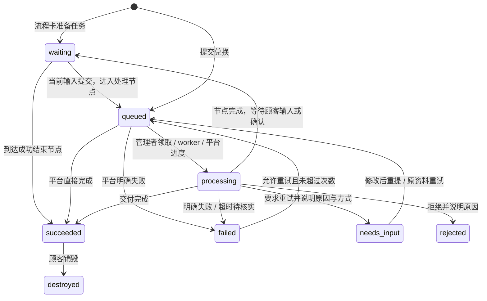

# 接口与事件协议

既有通知事件与 `/api/callbacks/{product_id}` 保持 v1。0.8.0 新增的流程私有 Worker 使用独立 v2 签名；任务流程定义本身为 `version:1`，三者不是同一个版本号。

所有 JSON 使用 UTF-8。API 错误为 `{"detail":"说明"}`，HTTP 400/422 是输入错误，401/403 是认证或权限，404 是不存在，409 是状态冲突，410 是凭证、卡密或领取已失效，408 是上传超时，413 是上传大小或数量超限，429 是限流，507 是服务器文件存储额度或磁盘空间不足。外部平台不访问商家会话接口。

## 店铺与账号范围

旧业务迁入默认店铺。店主浏览器和 CLI 会话固定到 `shop_id`，只能访问本店商品、卡密、任务、附件、管理链接、配置档案与审计；商品链接仍只授权一个商品。平台管理员的 `shop_id=null`，可以维护平台和跨店资源，跨店创建或绑定时须明确店铺。每个业务入口都重新检查店铺启用状态和归属，不以顾客参数或客户端传入的 `shop_id` 替代授权。

公众注册默认关闭；平台管理员先配置 TLS SMTP，再邀请店主。店主使用邮箱密码、可选 TOTP 或多个 Passkey；平台管理员首次密码只用于注册 Passkey，之后禁用首次密码。SMTP、邮件队列、TOTP 和处理器配置档案加密保存；处理器模板和说明只有明确标为 `secret:false` 时才允许本店店主及平台管理员读回，真实凭据不回读。完整流程和 CLI 示例见[多店与账号](shops.md)。

| 接口 | 范围与用途 |
| --- | --- |
| `GET/PUT /api/platform/settings` | 仅平台管理员：公众注册与 SMTP；SMTP 密码不能读回 |
| `GET/POST /api/platform/shops` | 仅平台管理员：列出或创建店铺 |
| `PATCH /api/platform/shops/{id}`、`POST /api/platform/shops/{id}/invite` | 仅平台管理员：启停、额度或重新发送邀请 |
| `GET/PATCH /api/shop/account` | 店主自己的账号；敏感操作需密码与已启用的第二因素 |
| `POST /api/auth/email/login` | 店主邮箱密码登录；已启用 TOTP 时验证第二因素 |
| `POST /api/auth/invite/claim`、`/api/auth/register/email/request`、`/api/auth/register/email/confirm` | 一次性邀请或邮件注册，须符合平台设置 |
| `POST /api/auth/password/reset/request`、`/api/auth/password/reset/confirm` | 邮件重置店主密码；已启用 TOTP 时仍需第二因素 |
| `POST /api/auth/totp/setup`、`confirm`、`disable`、`backup-codes` | 本店 TOTP 设置、确认、关闭或轮换恢复码 |
| `GET/POST /api/admin/processor-profiles`、`GET/PUT/DELETE /api/admin/processor-profiles/{id}` | 店主自己的加密配置档案；平台查询或创建显式选店；读取元数据、配置状态和明确非秘密字段，不返回凭据 |
| `GET/PUT/DELETE /api/admin/processor-profiles/bindings/{product_id}` | 同店、同处理器的商品绑定，PUT 传 `{profile_id}` |

付款适配默认关闭，提供商尚未确定。制卡、排队、预设演示或本地测试都不代表实际付款成功。

## 任务状态



`waiting` 用于流程的待开始、顾客输入和展示确认，不能作为商品队列的可领取任务。顾客等待状态不等于处理者在运行。流程中的一个处理节点成功也不等于整单交付，正常成功路径须到成功结束节点才交付；取消、拒绝、处理超时及不可安全继续的失败可直接终止，不必走到配置的 end；详细状态与 `flow_epoch` / `revision` 规则见[任务流程](task-flow.md)。

任务 ID 在失败重试或退回补充后保持不变，`attempt` 从 1 递增。平台必须以稳定任务 ID 去重外部交付，以 `(task_id, attempt)` 区分状态回调。旧尝试的回调 HTTP 409。终态不能覆盖；外部回调重复报告相同的成功或失败终态时返回当前结果，不修改内容。有步骤计划时，进度由已完成步骤计算，处理中最高 99%，成功强制为 100%；没有步骤计划时保留原来的百分比接口，处理中进度不能倒退。

商品规则 `allow_retry`、`max_attempts` 与失败结果 `retryable` 必须同时满足，才能重试。没有确认未交付的失败不能标记为可重试。Webhook 或队列超过 1 小时未更新，以及自动处理器中断，都会进入不可自动重试的失败状态；商家在核实后可放行。过期尝试的待投递 `redemption.requested` 会取消，不继续启动旧任务。

队列审核另有两种结果，均要求说明原因：`needs_input` 表示需要重试，卡密回到 `ready`；`retry_mode=revise` 要求修改后重提，`reuse` 使用已保存的原资料。`retry_reason_type` 区分 `customer_input`、`external`、`processor`。这不是发货失败，不受 `allow_retry` 或 `max_attempts` 限制。顾客实际重试时沿用任务的输入输出、规格和步骤快照，增加 `attempt`，重置进度和已完成步骤。卡密过期、撤销或店铺停用后仍不能提交。`rejected` 为拒绝终态，卡密同时变为 `rejected`，不能重新兑换或领取内容；已有领取链接仍可查看拒绝原因。

## 支付平台生成卡密

在 SSH 终端执行 `uv run python -m extore.cli integration-key`。命令生成或轮换仅能发行卡密的 API Key，只显示一次；与商品 Webhook 密钥无关。

```http
POST /api/integrations/cards
Authorization: Bearer <API-Key>
Idempotency-Key: payment-order-unique-id
Content-Type: application/json

{"product_id":"商品 UUID","count":1}
```

响应 `{"codes":["XXXXXXXX-XXXXXXXX-XXXXXXXX-XXXXXXXX"]}`。数量 1–1000。幂等键长 8–200 字符。同键同请求返回原卡密，不再生成；同键不同请求 HTTP 409。响应加密持久化用于平台恢复，密钥位于 `EXTORE_DATA/issuance.key`；该接口持钥者可读取同幂等键原响应，不向顾客暴露该密钥。幂等记录永久保留，防止旧订单重新发行。轮换平台 Key 不清理记录。

发行请求也可传 `label` 批次名称（最多 100 字符）和 `expires`（未来的 Unix 秒，省略或 `null` 表示不到期）。它们同样参与幂等请求匹配；已有未带这些字段的请求保持兼容。

`variant_id` 指定本商品的规格，省略等同于 `"default"`。非默认规格参与幂等匹配；省略与显式默认规格保留旧请求的匹配方式。不存在的规格返回 400，已停用规格的新发行返回 409；已经成功的幂等请求仍返回原响应，不因后来停用而重新制卡。每张卡密保存发行时的规格快照，不能由顾客在兑换时换规格。

平台须持久化订单与请求幂等键，收到响应后再向顾客交付卡密。没有付款回调或支付逻辑。当前制卡 API Key 是平台级授权，持有者可为目标商品发行卡密，不是发给单个店主的隔离密钥；应仅由可信的上游支付服务保存。

## 卡密库存与统计

商家可使用 `/api/admin` 或 `/api/manage` 下的查询接口查看全店或指定商品；商品管理链接使用 `/api/manage`，需要 `cards.manage`，且始终限定自己的商品。与其他商品管理接口不同，这些统计查询允许商家省略 `product_id` 查看全店。

| 接口 | 查询参数 | 结果 |
|---|---|---|
| `GET /api/manage/card-stats` | 可选 `product_id` | `{summary,products}`，总计与每个商品统计 |
| `GET /api/manage/card-inventory` | `product_id,variant_id,status,batch_id,search,offset,limit` | `{items,total,summary,offset,limit}`，过滤库存与全范围统计 |
| `GET /api/manage/cards/{id}/history` | 可选 `product_id` | `{card,timeline}`，单张卡密状态与处理时间线 |

三个查询均有对应 `/api/admin/...` 接口。库存 `offset` 从 0 开始，`limit` 为 1–500；`search` 只匹配内部卡密 ID 或末 6 位。列表保留批次 ID 与名称、到期时间、首次验码时间、任务状态、尝试次数及领取记录，不返回完整卡密或摘要。旧卡没有可恢复的尾号时，`code_suffix` 为 `null`；尾号不保证唯一，内部 ID 才用于精确定位。

库存 `state` 保留原卡密生命周期值 `ready`、`reserved`、`used`、`rejected` 或 `revoked`；`status` 是结合任务与到期信息计算的展示状态，用于筛选。旧卡的批次、尾号与首次验码不会凭空回填；新验码记录从启用跟踪后开始，已有任务与领取记录仍计入统计。

库存项带 `variant_id` 与发行时的 `variant_name`。统计商品中的 `variants` 数组按规格列出 `variant_id`、名称、描述、参考价、币种、启用状态及 `summary`；指定商品时也返回该商品规格统计。旧卡计入默认规格，停用或历史规格仍计入商品总数。

统计口径：

| 字段 | 含义 |
|---|---|
| `total` | 已发行总数 |
| `remaining` | 未到期、未撤销的 `unused` 加 `needs_input`；退回补充计回剩余 |
| `available` | `remaining` 加符合重试条件的失败卡密；已有任务的卡密仍归原顾客使用 |
| `used` | 已有任务且任务不处于 `needs_input` 的卡密数；退回补充会减回，重提后计入 |
| `verified` | 已记录至少一次成功验码的卡密数 |
| `viewed` | 至少领取过一次内容的卡密数 |
| `in_progress` | 排队或处理中的卡密数 |
| `completed` | 已成功或已销毁的卡密数 |
| `failed` | 当前失败任务的卡密数，不含退回补充或拒绝 |
| `rejected` | 已拒绝的卡密数，计入 `used`，不计入剩余、失败或完成 |

`summary.states` 的状态互斥：`unused`、`needs_input`、`queued`、`processing`、`succeeded`、`failed_retryable`、`failed_terminal`、`destroyed`、`revoked`、`expired`、`rejected`，可作为库存 `status` 筛选值。库存响应的 `summary` 始终统计整个权限范围，不随状态、批次或搜索过滤改变；`total` 是筛选后的条数。

`expired` 表示未提交或退回补充且已到期；失败任务到期后归入 `failed_terminal`。已拒绝的任务到期后仍为 `rejected`，撤销状态优先。`needs_input` 虽计回剩余，仍绑定原任务，不能当作从未使用的卡密再次销售。一次领取只增加领取记录，任务仍为 `succeeded`，不会自动变成 `destroyed`。

到期限制尚未兑换卡密的新提交、失败重试及退回补充后的重提；已经成功的交付仍按查看规则领取，到期不会销毁已有结果。历史包含发行、验码、提交、重试、进度、成功、失败、退回补充、拒绝、领取、销毁与撤销记录，不返回参数、消息、交付结果、私密领取链接、原卡密或摘要。

## 商品配置

`mode`: `manual` 表示队列，人或 AI 通过管理接口领取与处理；`webhook` 表示独立外部服务；`script` 是保留的内部代码名，表示预设白名单处理器。
`delivery`: `content` / `service`。
`view_policy`: `repeat` / `once`。
`public`: 首页是否公开显示商品。

### 商品规格

`variants` 为 1–100 个规格，代码名在本商品内唯一。例如：

```json
{
  "variants": [{
    "id": "standard",
    "name": "标准版",
    "description": "一个账户，三十天服务",
    "price": "12.50",
    "currency": "CNY",
    "attributes": {"accounts": 1, "days": 30},
    "enabled": true
  }]
}
```

`id` 匹配 `[a-z0-9][a-z0-9_-]{0,39}`；`name` 去除首尾空白后为 1–120 字符，`description` 默认为空、最多 10000 字符。`price` 是参考价，以非负十进制**字符串**或 `null` 保存，文本匹配 `[0-9]+(?:\.[0-9]{1,6})?`、最多 100 字符，规范化后最多 12 位整数；不接受指数、正负号或 JSON 数字，多余的前导零和小数尾零会规范化。`currency` 为 3–5 个大写字母，默认 `CNY`。参考价仅供外部商城配置参考，实际售价由商家在商城确定。Extore 只负责兑换与交付，不计算订单金额或收款。字段名 `price`、十进制数值与 `currency` 币种保持兼容。

`attributes` 最多 20 项，属性名非空、最多 100 字符，值只能是文本（最多 1000 字符）、有限数字、布尔值或 `null`；整数绝对值不得超过 `9007199254740991`，大整数用文本表示。不能嵌套数组或对象。`enabled` 默认 `true`。

未配置规格的旧商品默认采用 `{id:"default",name:"默认规格",description:"",price:null,currency:"CNY",attributes:{},enabled:true}`。旧卡缺少快照时也使用这个固定默认值，不继承后来修改的属性。发行过任意卡密的规格不能删除（409），可以停用或修改展示、参考价和属性；这些修改只影响后续发行。现有卡密仍按原快照兑换，停用不会使旧卡失效。

### 输入与输出

队列商品用 `parameters` 定义顾客输入，用 `outputs` 定义交付结果。两者采用相同的字段描述，例如输入参数：

```json
{
  "key": "account_email",
  "label": {"zh-CN": "账户邮箱", "en": "Account email"},
  "type": "email",
  "required": true,
  "description": {"zh-CN": "## 查找邮箱\n1. 打开账户设置。\n2. 复制登录邮箱。"},
  "collapsed": true
}
```

输出字段示例：

```json
{
  "key": "resource_url",
  "label": {"zh-CN": "资源链接", "en": "Resource URL"},
  "type": "url",
  "required": true,
  "description": {"zh-CN": "打开链接领取你的资源。"},
  "collapsed": true
}
```

代码名匹配 `[a-z][a-z0-9_]{0,39}`，输入和输出各自唯一、各最多 30 个。类型支持 `text` / `email` / `url` / `textarea` / `number` / `file` / `select` / `boolean` / `image` / `images`，输入值最多 10000 字符。未知字段拒绝；服务端验证必填、邮箱、HTTP/HTTPS 链接与有限数字。值继续使用字符串，字段名称和 Markdown 描述按当前语言展示，`collapsed` 决定教程默认折叠或展开。

| 类型 | 值与定义 |
| --- | --- |
| `select` | 值为已定义的选项代码。普通商品配置 `options` 为 1–100 项 `{value,label}`；代码为最多 100 字符的稳定 ASCII，匹配 `[A-Za-z0-9][A-Za-z0-9_.-]{0,99}`，显示名称使用 i18n 文本。流程节点最多 50 个选项。 |
| `boolean` | 字符串 `"true"` 或 `"false"`；可选字段还允许空字符串。`"false"` 是有效回答，不能当作未填写。 |
| `file` / `image` | 服务端上传后返回的一个文件 ID。`image` 必须是服务端实际解码通过的静态 PNG、JPEG 或 WebP，不能用路径、外部 URL 或 data URL 替代。 |
| `images` | 字符串中的 JSON 文件 ID 数组，例如 `"[\"UUID_1\",\"UUID_2\"]"`。保留顺序、拒绝重复，默认最多 10 张，`max_items` 可设 1–20。可选空集合规范为 `"[]"`。 |

图片每张分别上传、计量和绑定；每张最多沿用当前单文件上限（默认 20 MiB），最多 1600 万像素，拒绝 SVG、GIF、动画和无效容器。服务端保留原文件字节，不自动删除 EXIF 等元数据。`sensitive:true` 仅允许任务流程的文本输入，不能设在普通商品参数或交付输出上；短期输入的显示与有效期规则见[任务流程](task-flow.md#短期敏感输入)。

内容商品必须有输出字段。省略 `outputs` 时默认一个必填的 `content` 文本字段，兼容旧商品。服务商品 `delivery="service"` 必须使用 `outputs=[]`，仅返回状态，不产生交付内容。

每个任务在首次提交时冻结自己的 `parameters` 与 `outputs`。队列商品后续可调整输入输出定义，包括新增文件字段，修改只影响尚未创建任务的卡密；已有任务的提交重试、结果校验、领取和附件均使用原定义。旧任务首次读取时补存快照，编辑商品前会先冻结尚未绑定的旧任务，避免套用新定义。

发过卡密的商品仍不能改变处理方式、交付类型、查看规则、处理器 ID 或签名密钥。Webhook 商品还不能改变输入输出的代码名、类型或必填规则，仍可改善名称、Markdown 和折叠偏好；预设处理器的字段由代码定义，不能自改。需要改变这些冻结设置时创建新商品。

### 可选任务流程与文本库存

`task_flow=null` 保留普通兑换。配置的声明式流程包含输入、处理、展示和结束节点，可使用有限条件分支、字段引用与超时路径；它不能包含代码、模板执行、命令、任意处理器选择或动态联网权限。图和对应处理配置在卡密发行时冻结，后续编辑只影响之后发行的卡密；缺少快照的旧卡不会继承新图。见[完整定义与示例](task-flow.md)。

`mode="stock"` 为一卡一文本，`delivery="content"`，不接收顾客参数、不进入处理队列、不运行处理器或 task_flow。管理者选择规格，通过 `POST /api/manage/cards/import-text` 或 `/api/admin/cards/import-text` 导入 UTF-8 文本；每个非空行绑定一张新随机卡密，本次相同文本行去重，后续可明确重复补货。导入额度、原文返回与领取规则见[一卡一文本](text-stock.md)。

### 处理步骤与联系邮箱

`progress_steps` 默认为 `[]`，最多 30 个 `{id,label}`，`id` 使用规格相同的稳定代码名格式且不能重复。`label` 为 1–20 项多语言文本，语言代码非空且最多 40 字符，每个显示名称非空且最多 200 字符。数组顺序就是展示顺序。`support_email` 默认为空字符串；非空值去除首尾空白并验证邮箱格式，最多 254 字符。

任务提交时冻结步骤计划。商品后续修改计划只影响新任务；旧任务首次读取或商品编辑前绑定一次原计划。已有空计划任务可通过下文的批处理请求明确设置一次任务专用计划。联系邮箱由商品当前配置读取，显示给需要求助的顾客。

## 预设自动处理器

处理器只能来自 [TokenNotIncluded/extore-processors](https://github.com/TokenNotIncluded/extore-processors) 的白名单目录。`processors/official` 由主仓库 Git 子模块记录固定提交，运行时按 `processor_id` 查找预设，不从任意仓库、文件路径或商家上传代码加载程序。商品的 `script` 字段为兼容保留，但必须为空。

`GET /api/admin/processors` 供商家查询预设；`GET /api/manage/processors` 需要 `product.edit`。每个预设包含 `id`、多语言名称与说明、`delivery`、`parameters`、`outputs`、`progress_steps` 和 `shop_configuration`（兼容名称 `configuration`）。这些结构、字段敏感性和默认值由代码定义，目录不包含商家保存的实际值。店主创建本店配置档案并绑定商品，发行卡密保存档案 ID 与修订；自动商品的顾客输入与交付输出必须与预设代码一致。旧 `processor_config` 兼容输入仍创建独立档案；店主及平台管理员的商品编辑接口可读回明确非秘密字段，商品管理链接和顾客读取仍返回空对象，且不能通过商品管理链接设置店铺配置档案。

档案列表、详情、创建和更新响应中的 `configuration` 仅包含当前处理器定义里严格 `secret:false` 的已保存字段；`configured_fields` 是已保存非空字段名的数组，只表达配置状态。秘密字段、未声明字段、缺失 `secret` 或 `secret` 不是严格 `false` 的值不回读；商品 owner 接口的 `processor_config` 使用同样规则。绑定响应的 `profile.configuration` 读取 `bound_revision`，不会替换为档案最新值。商品管理链接和顾客接口不返回配置值；复制商品资料提示词排除全部处理器配置，私有 CLI 编辑响应也不会暴露秘密或未知字段。

档案 `PUT` 合并新字段与原值：省略字段或秘密字段传 `""` 会保留原值，可选非秘密字段传 `""` 则清空。必填模板传 `""` 返回 422，不以默认值代替用户明确提交的空值。保存继续创建加密修订，商品绑定和卡密冻结修订的规则保持不变。

### 工作流配置协议

配置档案 `POST` 和 `PUT` 支持 `workflow`。创建只接受 `variables`、`secrets` 和 `runtime`，不接受删除字段；更新还可指定 `delete_variables`、`delete_secrets`：

```json
{
  "workflow": {
    "variables": {"BRAND_NAME": "示例店铺"},
    "secrets": {"SERVICE_TOKEN": "仅在私密文件中填写"},
    "runtime": {
      "timeout_seconds": 120,
      "memory_mb": 256,
      "cpu_seconds": 120,
      "max_output_bytes": 1000000
    }
  }
}
```

读取、创建和更新响应只返回 `workflow={variables,runtime,configured_secret_names}`，后者为已配置秘密名称的排序数组，永远不包含 `secrets` 值。店主只能读取、修改本店档案；平台管理员需明确店铺。商品管理链接、顾客读取和共享商品资料导出不包含工作流内容。

名称匹配 `[A-Z][A-Z0-9_]{0,63}`，`EXTORE_` 前缀保留，系统环境、语言运行时、动态加载器和代理名称及前缀也不可用于新配置，例如 `PATH`、`HOME`、`PYTHON*`、`LD*`、`BWRAP_*` 和 `*_PROXY`。`variables` 和 `secrets` 各最多 64 项，值必须是合法 UTF-8 字符串且不能含 NUL，每值最多 8192 个 UTF-8 字节，两组合计最多 65536 字节；空秘密占位和删除名称也必须通过名称与数量校验。变量和秘密不能重名。`PUT` 两组逐键合并，省略项保留；普通变量允许保存空字符串，秘密空字符串保留已有值，首次写入的空秘密忽略。删除使用对应名称数组，设置与删除同组同名项返回 422；先删除原组再设置另一组可显式迁移名称，最终仍不能重名。`runtime` 逐键合并，未指定的上限保留。

| `runtime` 字段 | 默认值 | 允许范围 |
| --- | --- | --- |
| `timeout_seconds` | 120 | 10–120 秒 |
| `memory_mb` | 256 MiB 地址空间 | 64–512 MiB |
| `cpu_seconds` | 120 | 1–120 秒 |
| `max_output_bytes` | 1000000 | 65536–1000000 字节 |

这些字段只接受整数，拒绝布尔值、未知字段及超出范围的值。`memory_mb` 按 MiB（1024² 字节）设置进程地址空间上限 `RLIMIT_AS`。它们是固定离线处理器运行的资源上限，不能用配置添加命令、镜像、挂载或网络能力。工作流与处理器配置同属一个加密修订；商品绑定读取 `bound_revision`，发行卡密冻结同一档案 ID 与修订，worker 只解密该卡密绑定的版本。更新最新档案不会改变旧卡及重试的变量、秘密或运行限制；旧密文档案读取时采用默认工作流。worker 在启动前检查完整编码输入不超过 200000 字节，这包括顾客参数、规格和步骤快照、处理器配置及工作流环境，独立于工作流值的 65536 字节限额。

档案保存时另检查包含处理器配置与工作流的完整 JSON 编码不超过 200000 个 UTF-8 字节，超过返回 422，不创建修订。它与运行时整份任务输入的限额分别检查，不能只按变量原文长度判断是否可执行。

`Task.environment` 和 `ProcessorContext.environment` 是按原名称读取变量与秘密的只读映射。操作系统环境统一使用 `EXTORE_WORKFLOW_<NAME>`，例如 `EXTORE_WORKFLOW_BRAND_NAME`，不覆盖 worker 的系统变量。顾客输入不能替换这些上下文；秘密不自动参与文本模板替换。运行的处理器仍能读取商家交给它的秘密，可信代码审核和禁止在输出、进度与日志中泄露秘密仍是必要边界。

### 预设与处理进度

| `processor_id` | 商家配置 | 顾客输入 | 输出 |
|---|---|---|---|
| `resource_link` | 必填 HTTPS `resource_url`，可选 `message` | 无 | 必填资源链接、可选说明 |
| `personalized_text` | `template` 纯文本模板 | 必填 `name`，最多 200 字符 | `content` 文本 |

`resource_url` 最多 2000 字符，说明和模板最多 10000 字符。模板仅支持 `$name`、`${name}` 与 `$$` 文本替换，不执行代码。配置秘密不出现在顾客或管理读取接口，worker 只解密该任务冻结的本店档案版本。商品可先保存为草稿，发行卡密和执行时必须满足必填配置；更新修订不改旧卡，撤销档案会阻止旧修订执行。

处理器可在空任务计划中输出 `kind="progress"` 与 `progress_steps` 初始化一次 1–30 项步骤，后续报告已完成项和消息。已有非空计划不能替换；进度、规格与配置版本快照在重试时保留，新的尝试才清空完成项。SDK 的 `Task.define_steps()`、`Task.progress()` 和子进程 JSON Lines 规则见[Python SDK](python-sdk.md)。

### 处理器运行边界

内置商品处理器需要 Linux、bubblewrap 0.12 及以上（`bwrap`）和 libseccomp，以及允许使用的内核命名空间。worker 采用固定的离线沙箱启动审核后的代码：隔离网络、进程和挂载空间，丢弃能力，只读挂载所需解释器、标准库、处理器和 SDK。数据库、主密钥、其他店铺数据和宿主的第三方包不挂载到处理器中。

资源策略由发行时冻结的 `workflow.runtime` 执行，处理器不能自行增加权限。当前运行环境只支持固定的文本与资源链接预设，通过 stdin 接收任务、stdout 返回 JSON Lines。seccomp 禁止 fork、clone、exec、socket、IPC、memfd 以及创建文件或目录；不能联网、启动外部程序或在本地生成 DOCX、PPTX。`/work` 与 `/tmp` 各有 16 MiB 上限，但不授予创建文件的权限。每次任务最多报告 100 次进度，打开文件描述符最多 64，关闭 core dump；总输出受冻结上限控制。缺少依赖、内核不支持隔离或策略加载失败时拒绝执行，不降级为普通宿主进程。完整输入、输出、时间、地址空间和 CPU 均有限额；超过限制或异常退出按失败处理，等待商家核实是否已经交付。

复杂文档与 PPT 商品使用队列，由外部 AI 通过已授权 CLI 读取需求、处理材料并上传成品；它们不在这个内置离线运行环境中生成。隔离不能防止处理器把它有权读取的秘密故意放入输出，所以仍不接受任意商家上传脚本。升级商品处理器需审核源码与字段定义，再更新主仓库固定提交并发布程序包。未来需要联网或写盘的处理器须另行设计受控服务与 cgroup 资源管理；支付类能力还须按店铺校验目标、额度和幂等键。当前没有这些 broker，也不允许通过工作流打开直连付款。其他自动化可使用独立的 HTTPS 公网 Webhook 服务。

## Webhook 事件

本节是兼容的 v1 通知。流程私有执行内容走加密的独立派发记录，普通事件、事件查询和重投不携带该执行信封或短期敏感值。只有按当前节点授权的私有 Worker v2 能取得该节点明确映射的输入，见[私有 Worker 协议](private-worker.md)。

商品配置 `webhook_url` 和 `webhook_secret`（至少 32 字符）。所有处理方式都可配置通知 URL；只有 `webhook` 处理方式接受外部状态回调。交付内容不写入事件；用户参数仅在 `redemption.requested` 携带。

```json
{
  "id": "事件 UUID",
  "type": "redemption.requested",
  "version": 1,
  "created_at": 1790000000.0,
  "product_id": "商品 UUID",
  "data": {
    "id": "任务 UUID",
    "state": "queued",
    "attempt": 1,
    "progress": 0,
    "message": "",
    "variant": {"id":"default","name":"默认规格","description":"","price":null,"currency":"CNY","attributes":{},"enabled":true},
    "steps": [{"id":"verify","label":{"zh-CN":"核实资料","en":"Verify details"},"done":false}],
    "completed_steps": [],
    "params": {"account_email": "user@example.com"}
  }
}
```

完整事件：

| type | 触发时机 | data |
|---|---|---|
| `redemption.requested` | 首次提交、合规失败重试或补充后重提 | 任务状态字段及 `params` |
| `fulfillment.progress` | 领取任务、自动处理开始、进度更新 | 任务状态字段 |
| `fulfillment.succeeded` | 首次成功交付 | 任务状态字段 |
| `fulfillment.failed` | 明确失败、超时或中断 | 任务状态字段 |
| `fulfillment.needs_input` | 已领取的队列任务要求重试 | 任务状态字段，`message` 为原因，含 `retry_mode` 与 `retry_reason_type` |
| `fulfillment.rejected` | 已领取的队列任务被拒绝 | 任务状态字段，`message` 为原因 |
| `delivery.viewed` | 内容成功领取，每次重复查看也产生事件 | 任务状态字段 |
| `delivery.destroyed` | 顾客首次销毁 | 任务状态字段，`state=destroyed` |

上述任务状态字段都带服务端保存的规格 `variant`、步骤快照 `steps`（每项含 `done`）与 `completed_steps`。它们是任务元数据，独立于顾客 `params`；顾客或回调不能改写规格及既有计划。事件不包含交付 `output` 或文件内容。

事件与任务变更同一 SQLite 事务提交。外部平台应快速校验、入队并返回 2xx；随后异步执行。签名字段：

```text
X-Extore-Timestamp: Unix 秒
X-Extore-Nonce: 随机字符串
X-Extore-Signature: HMAC-SHA256 十六进制
X-Extore-Event-Id: 事件 UUID
Content-Type: application/json
```

签名输入为 `timestamp + "." + nonce + "." + 原始请求体字节`，密钥为商品的 `webhook_secret`。必须对原始字节验签，不得将 JSON 重编码后验签。允许时钟误差 ±300 秒；服务器需要正确同步时间。

投递保证为**至少一次**。重试使用相同事件 ID、新时间和新 nonce。接收端需持久化事件 ID 防止重复消费；SDK 只验签，不替你存储去重状态。一次 HTTP 投递 15 秒超时，最多 8 次，间隔 `min(3600, 2^attempts * 5)` 秒。只认可 2xx，不跟随重定向。投递失败记为 `dead` 后由商家重投；过期请求记为 `cancelled`。

不同任务不保证全局顺序；顾客状态以 API 为准。超时重试可能重复到达，另一平台必须以任务 ID 做发货去重，不能只依赖事件 ID。收到了非 `redemption.requested` 的通知时不要启动发货。

## 签名回调

```http
POST /api/callbacks/<product_id>/<task_id>
X-Extore-Timestamp: ...
X-Extore-Nonce: ...
X-Extore-Signature: ...
Content-Type: application/json
```

```json
{
  "attempt": 1,
  "state": "succeeded",
  "progress": 100,
  "message": "已完成",
  "output": {"resource_url": "https://downloads.example.com/receipt"},
  "retryable": false
}
```

`state` 可为 `processing` / `succeeded` / `failed`。成功交付使用 `output` 对象，键是商品 `outputs` 的代码名，值必须为字符串。未知字段、缺少必填值或类型不符返回输入错误；所有输出值合计最多 100000 字符。文本保留格式，邮箱、数字和 URL 去除两端空白；URL 只允许不含用户名和密码的 HTTP/HTTPS 地址。

回调可传 `completed_steps`，例如 `{"state":"processing","attempt":1,"completed_steps":["verify"],"message":"资料已核实"}`。最多 30 个有效且不重复的步骤 ID，必须来自该任务快照；未知步骤返回 400，同一尝试撤回已完成步骤返回 409。省略或 `null` 保留原完成集合。带计划的任务按完成数计算进度，忽略手填百分比；完成全部步骤但仍处理中时为 99%，成功自动完成全部步骤并设为 100%。没有计划时继续使用 `progress`。实际重试开始时清空完成集合和进度，保留原计划。

旧 `content` 仅兼容只有一个 `content` 输出字段的商品。同时提供 `content` 和 `output` 时必须一致。服务商品不接受非空 `output`，兼容旧请求时忽略 `content`，只保留状态。`message` 最多 1000 字符，不能用它代替私密交付结果。

签名算法与事件相同。服务器持久化 nonce，在有效签名时间窗口内拒绝重放；相同 nonce 再到达 HTTP 409。商品不能跨商品更新任务，旧 attempt 或已销毁任务返回 409。签名不依赖浏览器 Origin 或 Cookie。

### 流程私有 Worker v2

流程处理节点的派发与回调使用独立 v2，不将全图、其他节点输入或短期敏感值放入 v1 事件。执行身份为 `{shop_id,product_id,job_id,attempt,node_id,flow_epoch,action_id}`；服务器按发行快照取得 URL、签名密钥和当前节点范围。方向、准确 HTTPS audience、HTTP 方法、实际路径、时间、nonce、正文 SHA-256 及全部身份字段都被签名。

Worker 使用 `POST /api/callbacks/v2/{product_id}/{job_id}/result` 回调，JSON 为 `{version:2,result_id,update}`。`update.attempt` 必须与已验签执行一致；节点、flow_epoch 和 action_id 由已验签请求头中的 scope 决定，若正文提供 flow_epoch 或 action_id 也必须一致，否则返回 409。SDK 自动附带对应更新字段。有效范围内同一结果重试使用相同 result_id 和相同正文、新的传输 nonce；相同 ID 改正文返回 409。上传和下载另有按节点字段限制的签名接口，不能用普通管理 Cookie 或 CLI Bearer 代替。

这里的「私有」指商家自己的处理服务，目标仍须是 HTTPS 公网地址；不允许私有 IP、重定向、查询参数或由顾客输入改变目标。完整签名编码、附件、重放和超时规则见[私有 Worker v2](private-worker.md)，SDK 用法见[SDK v2](python-sdk-v2.md)。

## 顾客接口

顾客浏览器的写入请求需要配置的 `Origin`，防止跨站操作。

| 接口 | 请求 | 结果 |
|---|---|---|
| `GET /api/products` | 无 | 仅公开商品及输入输出说明，无处理器秘密配置和密钥 |
| `POST /api/exchange` | `{code}` | 30 天兑换凭证、指定商品、发行规格 `variant`、已有任务 |
| `POST /api/redeem` | `{token,params}` | 创建、合规失败重试或补充后重提任务，返回状态 |
| `POST /api/retry` | `{token,card_id?}` | 仅 `needs_input/reuse` 且 `can_retry=true`：沿用保存的原参数和输入附件重试 |
| `POST /api/receipt` | `{token}` | 商品、发行规格 `variant` 与状态；退回补充时包含原 `params` 供顾客修改，不返回交付结果 |
| `POST /api/receipt/reveal` | `{token,card_id?}` | 显式领取 `{output,content,files?}`；`content` 为兼容可读文本，一次领取原子消费 |
| `POST /api/receipt/destroy` | `{token,card_id?}` | 永久关闭应用内交付内容 |
| `POST /api/task-flow/start` | `{token,card_id?,flow_epoch,expected_revision}` | 明确开始当前 input 或初始 display，返回当前 job_view；开始前不展示输入题目或计时 |
| `POST /api/task-flow/answer` | 同上，另加 `values` 字符串对象 | 提交当前输入，按冻结路径进入下一步 |
| `POST /api/task-flow/continue` | `{token,card_id?,flow_epoch,expected_revision}` | 明确离开当前展示步骤 |
| `POST /api/task-flow/cancel`、`POST /api/task-flow/restart` | 同上 | 取消或在规则允许时重新开始流程，旧 epoch 失效 |

不能根据商品 UUID 直接打开非公开商品。兑换凭证、商品管理链接和卡密都是秘密，不记录在分析工具中，不植入第三方前端脚本。状态、任务列表与事件不自动返回私密结果。一次领取会清除结构化 `output` 和兼容 `content`，附件另按每文件一次下载处理；销毁会同时清除结果及该卡密的全部输入、输出附件。销毁只关闭 Extore 内的领取，不撤销上游资源链接。

### 旧批量接口兼容

`POST /api/exchange` 的 `code` 可包含最多 30 张同商品卡密，用换行、空格、逗号或分号分隔，重复卡密只计一次。完整输入最多 8000 字符；原来单张卡密用空格替代连字符的格式保持兼容。网页与原生工具的调用语义见各自的[WebMCP 说明](webmcp.md#多张卡密兑换)，不要将新 partial 端点与本节旧整批端点混用。混入其他商品、无效或不可兑换的卡密时整批拒绝，不创建领取链接。

多张卡密响应为 `{token,batch:true,product,items}`；`POST /api/receipt` 返回相同的批量状态结构。每项包含 `card_id`、末尾 `suffix`、发行规格 `variant`、自己的 `product` 定义与已有 `job`。未提交的卡密使用当前商品输入定义，已有任务和重试使用自己的结构快照。一个链接覆盖这批卡密，有效期 30 天，不返回原卡密。

提交使用 `{token,items:[{card_id,params}]}`，每项单独填写参数；允许只提交部分卡密，整次请求在同一事务中提交或回滚。重复 `card_id` 或不属于该链接的卡密会被拒绝。领取、销毁、上传输入文件和下载交付文件均传入目标 `card_id`；未选择卡密或跨链接访问会被拒绝。单张卡密继续使用原有 `{token,params}` 请求。

### 逐卡校验与部分提交

0.8.0 的网页与顾客 CLI 多卡操作使用独立 `/api/batch/*` 端点，保留上述旧接口的整批语义；CLI 显式 `--atomic` 使用旧兼容模式。不同商品、规格，乃至同站不同店铺的有效卡密可以共用一个领取链接；新验码和提交仍逐张检查商品启用状态与卡密归属，卡密不能借此跨站试探或读取其他卡的附件。店铺停用后，原链接中已受理任务仍按原规则保留只读状态与交付，不能继续提交或上传。

| 接口 | 请求与结果 |
| --- | --- |
| `POST /api/batch/exchange` | `{code}`，最多 30 个输入项、8000 字符。返回 `{batch:true,partial:true,token,items,summary}`；全无可接受项时 HTTP 200 且 `token:null`。 |
| `POST /api/batch/receipt` | `{token}`，逐卡读取已有批量授权，返回 `{batch:true,partial:true,items,summary}`，不回显 token。旧批量 token 兼容，单卡旧授权返回 404。 |
| `POST /api/batch/redeem` | `{token,items:[{card_id,params}]}`，每卡显式独立参数对象；返回逐卡状态、`results` 和 `submission_summary`。一项错误在该卡的保存点回滚，不影响其他成功项。 |

校验项包含 `index`（原输入位置，从 0 开始）、安全尾号 `suffix`、`status`、`accepted`、`error` 与 `http_status`，仅 accepted 项包含 card_id、product、variant、job，不回传完整卡密。`status` 为 `valid`、`used`、`needs_retry`、`invalid` 或 `duplicate`；重复项另带 `duplicate_of`。`used/accepted=true` 表示该卡已有可查看任务，不是可以新建第二单；一次性卡已用不能重新建立授权，原领取链接仍按原查看规则领取。

提交的 `results` 按请求位置返回 `submitted`、`unchanged`、`error` 或 `duplicate`，以及安全错误与 HTTP 状态；card_id 只在属于当前链接时返回，job 只在成功项返回。`submission_summary` 是 `{total,succeeded,failed}`，调用方必须检查每项结果，不能把 HTTP 200 当作全部成功。请求整体不是对象、token 无效或 items 超过上限等错误仍会拒绝整个请求。

网页按商品、规格和完全兼容的冻结输入定义分组，相同组的非附件要求只填一次；已保存内容不同的卡分开。每张的附件分别上传、绑定、计量，不复用另一张的文件 ID。流程卡提交 `params:{}` 只创建 waiting 任务；必须由顾客逐卡显式 start，不能在粘贴、验码或批量准备时开始全部计时。一次领取、销毁或已撤销卡的单项失败不遮住其他卡的状态。

签名路由卡先在浏览器本地验签和分组，明确选择目标站点后才向发行站提交，不将完整下游卡密发给入口站后端。协议见[兑换路由](proxy-routing.md)。CLI 支持范围以当前[顾客命令](cli-customer.md)为准，不能把网页的新 partial 语义套到仍使用旧端点的调用方。

## 输入与交付附件

附件工作流面向队列与流程：商家在输入或输出中定义 `file`、`image` 或 `images`，上传后填入对应文件 ID 或有序 ID 数组字符串。上传文件作为数据保存，不安装或执行代码；预设自动处理器的字段仍由审核代码定义。流程附件另按节点、尝试、flow_epoch 和当前字段校验，上传不能跳过当前阶段。

| 接口 | 认证与请求 | 结果 |
|---|---|---|
| `GET /api/admin/storage` | 店主或平台管理员会话 | 店主仅本店 `stored_bytes,uploading_bytes,limit_bytes,active_uploads,upload_concurrency`；平台管理员另返回全站磁盘余量与保留量 |
| `GET /api/upload-limits` | 无认证 | `{max_file_bytes,max_card_bytes,max_card_files}`，不返回磁盘用量 |
| `POST /api/files/upload` | multipart：`token,card_id?,field_key,file` | 输入附件描述，`id` 填入 `params[field_key]` |
| `POST /api/manage/files/upload` | 管理会话，`queue.process`；multipart：`job_id,field_key,file` | 输出附件描述，`id` 填入成功请求 `output[field_key]` |
| `GET /api/manage/files?job_id=...` | 管理会话，`queue.view`，同商品 | 任务附件描述列表，不含内容或下载凭证 |
| `GET /api/manage/files/{file_id}/download` | 管理会话，`queue.view`，同商品 | 有权访问任务的附件下载，不消费顾客一次下载额度 |
| `POST /api/files/download` | JSON：`{token,file_id,card_id?}` | 已显式领取的输出附件下载 |

流程顾客上传还必须带 multipart 文本字段 `flow_epoch`、`expected_revision` 与 `node_id`，与当前 input 一致；流程管理上传必须带 `flow_epoch`，另可带 `action_id`，提供时须与当前 process 一致。这些字段从最新状态取得，不能用旧题目的编号。私有 Worker 使用独立 v2 签名上传，不使用这套管理表单。

上传只能包含规定的字段和一个文件。默认单文件 20 MiB、每张卡密现存附件合计 100 MiB、最多 100 个，可通过服务器环境变量降低或调整相应额度；当前单文件最高 20 MiB。超限返回 413。输入文件必须属于这张卡密及对应输入字段；普通单次兑换提交后不能替换，只有允许失败重试或需要重试时才能上传或重用输入，流程则只接受当前 input 字段。输出文件必须属于当前任务、尝试和对应输出字段，只有领取了该队列任务的处理者可上传。成功提交后绑定所选附件，未选草稿会清理；新尝试删除旧输出，保留可重用输入直到重新绑定。

新店默认附件额度 1 GiB，全站逻辑容量默认 5 GiB；店铺与全站均计入保留的 BLOB 和正在接收的实际文件字节。平台管理员调整单店额度不能低于该店当前存储与上传占用，也不能超过全站额度。同时最多 4 个上传，单次接收期限 5 分钟，实际磁盘至少保留 512 MiB 并另留写入空间。额度或磁盘不足返回 507，并发超限返回 429，接收超时返回 408。临时文件与数据库位于同一受检查的文件系统；所有容量和期限配置见[运行指南](getting-started.md#文件上传与存储)。

未绑定草稿默认 24 小时到期，由 worker 分轮清理；当前处理中尝试的输出草稿与已经绑定的附件不会因年龄被删。每 60 秒维护一轮，最多清理 100 条、20 MiB，并在清理事务后以 100 毫秒等待尝试截断 WAL；活跃读者或锁冲突时下轮重试。删除释放逻辑额度，SQLite BLOB 所在页可复用，数据库文件本身不自动缩小。

`reveal` 只释放本次结果实际引用的输出附件，返回文件描述（含 `id,field_key,filename,content_type,size` 等）。顾客下载还必须提交有效兑换凭证；文件 ID 本身没有下载权限。凭证只放在 POST JSON 或 multipart 请求体，不能拼成 GET 下载链接或 URL 查询参数。管理者 GET 下载依赖其浏览器会话或 CLI Bearer，不使用顾客凭证。

`repeat` 允许重复下载；`once` 的每个文件第一次下载在事务内清除文件内容，第二次返回 410，多文件各有独立的一次额度。应先保存 `reveal` 返回的文件 ID，再逐个下载；再次 `reveal` 不能恢复已消费的结果或附件。销毁删除该卡密全部附件，包括顾客上传的输入。普通文件作为下载附件，图片展示也需有效授权；网页明确预览一次性图片时消费一次额度，然后从本地 Blob 预览和保存，不再次请求服务器。切换卡密、页面或销毁会清理本地 Blob URL。

## 商家接口

商家完整接口可在 `/docs` 查看。浏览器认证 Cookie HttpOnly、SameSite=Strict、生产 Secure，写操作校验 Origin；店主 CLI 使用下文的设备授权与写操作签名。

店主可创建与维护本店商品、批量制卡、撤销未兑换卡密、维护商品管理链接、查看与重投事件，以及管理多个 Passkey。店主注册 Passkey 后邮箱密码仍可用，平台管理员首次密码在注册 Passkey 后禁用；浏览器添加或移除 Passkey 需要最近 10 分钟内登录，CLI 使用新的设备签名。没有邮箱密码的账号不能删除最后一个 Passkey；保留邮箱密码的店主可以移除自己的最后一个 Passkey。平台管理员全部遗失时通过 SSH `reset-auth` 恢复；店主使用邮件密码恢复。

`GET /api/admin/product-templates` 返回队列内容交付与队列服务模板。`POST /api/admin/products/quick` 接受 `{template_id,name?,from_product_id?}`：`template_id` 为 `manual_content`、`manual_service` 或 `existing_product`，复制已有商品时必须提供 `from_product_id`。响应 `{product,management_link}` 创建非公开商品及有效 7 天的配置链接，权限仅为 `product.edit` 与 `fulfillment.configure`，可交给 AI 或其他配置管理者。复制商品会更换签名密钥并移除原处理器秘密配置，不复制源商品的发货凭证。

## 商品管理链接

一个链接只授权一个商品。店长、处理人员等名称用于区分管理者，权限由链接的 `permissions` 决定。最大权限是该商品的全部管理权限，不包括创建其他商品、全店设置、支付平台 Key、商家认证或 Passkey 管理。

| 权限 | 允许的操作 |
|---|---|
| `queue.view` | 查看该商品任务、参数和处理进度 |
| `queue.process` | 人或 AI 领取队列任务，更新、完成、标记失败、退回补充或拒绝自己领取的任务；须同时有 `queue.view` |
| `queue.retry` | 核实失败任务后放行重试；须同时有 `queue.view` |
| `product.edit` | 查看与编辑商品展示信息和顾客参数；单独授予时不能读取签名密钥或更改发货、查看与重试规则 |
| `fulfillment.configure` | 读取与配置该商品发货方式、输出结构、查看与重试规则、预设处理器和签名密钥；须同时有 `product.edit` |
| `cards.manage` | 为该商品生成卡密、查看卡密状态、撤销未兑换卡密 |
| `events.manage` | 查看与重投该商品事件 |
| `links.delegate` | 为该商品生成更小权限的链接，查看与撤销自己的后代链接 |

全部八项权限用于店长管理指定商品。默认权限和升级前已有链接的权限为 `["queue.view","queue.process"]`，不会自动扩大。未知权限、空权限列表、处理或重试权限缺少 `queue.view`，以及自动发货配置权限缺少 `product.edit`，都返回 422。

`fulfillment.configure` 可以读取 Webhook 签名密钥。对于采用 Webhook 处理的商品，持有该密钥可以向系统提交该商品的签名回调。因此，此权限具有控制该商品外部发货的能力，不能只因为需要编辑商品展示就授予。队列操作仍单独校验 `queue.process` 与 `queue.retry`。

持有 `links.delegate` 的管理者可以创建子链接，限制如下：

- 商品必须与父链接相同。
- 子链接权限必须是父链接权限的**严格子集**，不能相同或增加。是否允许子链接继续委派，由是否保留 `links.delegate` 决定。
- 有效期不能超过父链接或任何祖先。父链接撤销或过期时，所有后代都失效，已登录会话也不能继续操作。
- 管理者只能查看和撤销自己的后代，不能撤销父链接或其他分支。撤销会级联撤销后代，并把它们尚在处理的任务放回原商品队列。

登录使用链接片段中的凭证提交 `POST /api/staff/login`，请求为 `{token}`。`/staff`、`/api/admin/staff` 和认证角色 `staff` 为兼容保留，界面统一称为商品管理链接。原始链接只在创建时返回，列表不包含凭证或数据库摘要。

`GET /api/auth/status` 的链接会话返回 `role="staff"`、`product_id`、`permissions`、`link_id`、`link_name`、`link_expires`、`parent_id`、`max_uses`、`uses`、`remaining_uses`、`max_cli_uses`、`cli_uses` 与 `remaining_cli_uses`。`link_expires` 是当前链接与全部祖先中最早的到期时间，使用 Unix 秒。权限与祖先有效性在每次操作时重新校验，不能只信任前端缓存的认证状态。

商家创建店长链接：

```http
POST /api/manage/links
Content-Type: application/json

{
  "product_id": "商品 UUID",
  "name": "店长",
  "days": 7,
  "permissions": ["queue.view", "queue.process", "queue.retry", "product.edit", "fulfillment.configure", "cards.manage", "events.manage", "links.delegate"]
}
```

店长使用同一接口生成处理人员链接，商品可省略，由当前链接确定：

```json
{"name":"资料处理","days":1,"permissions":["queue.view","queue.process"]}
```

`name` 长 1–100 字符；`days` 为大于 0、最多 90 的天数，可使用小数。商家省略 `days` 时有效 7 天；下级省略时为 7 天与父链接剩余有效期的较短者。显式期限超过父链接、权限相同或扩大，均返回 403。`permissions` 省略时使用默认的队列查看与处理权限，重复权限会去重。`max_uses` 是浏览器新登录额度，`max_cli_uses` 是新 CLI 设备绑定额度，均为 1–1000 的整数、默认 1；两项独立计数，子链接分别不能超过父链接配置的上限。后文新商品 CLI 授权的专用根链接自身不允许浏览器登录；明确获批 `links.delegate` 后，可以创建浏览器次数最多 1、CLI 绑定次数最多 1 的严格缩权子链接，期限仍不能超过原授权。

一次浏览器额度用于创建一个新的成功浏览器登录会话，事务内计数，耗尽后新登录返回 409。同一个有效会话重复提交同一链接不会再扣次数；耗尽不会自动注销已有会话，权限仍受链接期限和撤销约束。获取 `/staff#...` 页面或读取认证状态不消费额度，登录需要明确提交 `POST /api/staff/login`。更换浏览器、退出后重新登录等新会话需要剩余额度。

创建响应包含 `id`、`product_id`、`name`、`permissions`、`parent_id`、`created`、`expires`、`revoked`、`max_uses`、`uses`、`remaining_uses`、`max_cli_uses`、`cli_uses`、`remaining_cli_uses` 和一次性返回的 `url`。列表省略 `url`。撤销返回 `{ok:true,revoked_count}`，数量包括被撤销的链接及后代。商家兼容接口 `POST /api/admin/staff` 使用相同创建字段，但 `product_id` 必填；`GET /api/admin/staff` 查看全店管理链接，`POST /api/admin/staff/{id}/revoke` 撤销指定分支。

## 按商品管理接口

以下接口同时供商家和商品管理链接使用。GET、PUT 与路径撤销/重投接口用查询参数 `product_id` 选择商品：商家必须指定，链接持有人可省略并默认自己的商品；指定其他商品返回 403。`GET /api/manage/products` 返回最小商品概要，不需要队列查看权限。

| 接口 | 权限 | 请求与结果 |
|---|---|---|
| `GET /api/manage/products` | 有效管理会话 | 授权商品概要、规格、当前输入输出、步骤计划与联系邮箱 |
| `GET /api/manage/processors` | `product.edit` | 预设处理器预设与其代码定义的输入输出、配置项 |
| `GET /api/manage/product` | `product.edit` | 当前商品配置；没有 `fulfillment.configure` 时签名密钥与处理器秘密配置隐藏 |
| `PUT /api/manage/product` | `product.edit` | JSON 为商品配置；`product_id` 在查询参数，不放入 JSON；发货配置还需 `fulfillment.configure`，响应按 GET 的规则隐藏密钥 |
| `GET /api/manage/cards` | `cards.manage` | 卡密 ID、商品、状态与创建时间；不返回原卡密或摘要 |
| `POST /api/manage/cards` | `cards.manage` | `{product_id,count,variant_id?,label?,expires?}`；商品必填，数量 1–1000，默认 1；返回 `{codes,batch_id}` |
| `POST /api/manage/cards/{id}/revoke` | `cards.manage` | 仅撤销当前商品尚未兑换的卡密 |
| `GET /api/manage/events` | `events.manage` | 当前商品的事件及投递状态，不含完整参数、内容或签名密钥 |
| `POST /api/manage/events/{id}/retry` | `events.manage` | 仅重投当前商品 `dead` 的事件 |
| `GET /api/manage/links` | `links.delegate` | 商家查看当前商品全部链接；管理者只查看自己的后代 |
| `POST /api/manage/links` | `links.delegate` | `{product_id?,name,days?,permissions?,max_uses?,max_cli_uses?}`；创建同商品的更小权限链接 |
| `POST /api/manage/links/{id}/revoke` | `links.delegate` | 级联撤销当前商品内有权管理的链接分支 |

商品更新时，`webhook_secret` 留空表示保留原值，合并后再验证完整配置。没有 `fulfillment.configure` 的管理者提交隐藏的空处理器配置时保留原值，不能更改 `mode`、`delivery`、`view_policy`、`script`、`webhook_url`、`webhook_secret`、`allow_retry`、`max_attempts`、`processor_id`、`processor_config` 或输出字段结构，修改返回 403。拥有此权限仍受前文的已发卡冻结与内置预设限制。商品管理链接不能安装程序、创建新商品或调用全店 `/api/admin/*` 接口。

商家 `POST /api/admin/cards` 同样返回 `{codes,batch_id}`，用于定位本次发行的批次；支付平台制卡接口保持 `{codes}` 响应。

`GET /api/manage/products?compact=true` 与 `GET /api/admin/products?compact=true` 只返回商品摘要、精简规格及字段数量，不返回长描述、教程或表单结构。CLI 默认使用摘要，单商品详情通过 `/api/manage/product?product_id=…` 读取。HTTP 的 `PUT /api/manage/product` 接收完整配置；CLI 的 `product update` 先读取原配置，再按顶层字段合并修改，保留未提供配置。

## CLI 设备授权

商品管理 CLI 使用 Ed25519 设备密钥，与浏览器 Cookie 会话分开。CLI 可以主动申请一个商品的指定权限，或本店当前队列商品的流水线权限，由店主本人在浏览器选择范围并批准；无需先创建管理链接，也不向 CLI 传递管理链接原文。一个商品的实际访问仍对应自己的设备与权限，多个商品的聚合只在客户端完成。原有设备码绑定既有管理链接的 v1 流程继续兼容。网页「复制给 AI 的提示词」只复制公开接入说明，不创建申请、绑定票据或消耗登录次数。安装和命令用法见 [CLI 文档](cli.md)。本店流水线仅限队列权限；完整店主管理使用后文独立的店主流程。

`public_key` 是 32 字节 Ed25519 公钥的无填充 base64url（43 字符），`signature` 是 64 字节签名的同种编码（86 字符）。设备码申请的 `client_name` 为 1–100 字符，不得有首尾空白或 Unicode 控制类字符。签名文本使用 UTF-8，以单个换行连接字段，不再额外追加换行；`EXTORE_ORIGIN` 必须与服务器配置完全一致。

### 商品权限与本店流水线快照

新授权使用 `kind="product"` 或 `kind="shop.pipeline"`：

| 类型 | 商品范围 | 权限边界 |
| --- | --- | --- |
| `product` | 明确请求的一个商品，由服务器确定所属店铺 | 本文定义的商品管理权限；批准范围只能是申请权限的子集 |
| `shop.pipeline` | 明确店铺中，申请时快照内本次选择的队列商品（`mode="manual"`） | 仅 `queue.view`、`queue.process`、`queue.retry`，不能授予完整店主管理 |

处理或重试队列必须同时包含 `queue.view`；`fulfillment.configure` 必须同时包含 `product.edit`。服务器检查商品存在、店铺归属、店铺启用、请求设备密钥、批准者身份与近期认证。商品管理会话和 CLI Bearer 不能批准新范围；平台管理员或店主的浏览器操作也必须经过明确核对与批准，已有登录本身不等于批准设备。

一个 `pipeline_authorizations.id` 保存同一店铺、同一设备公钥、授权类型、商品快照、权限、期限、修订及批准者。它的 `pipeline_bindings` 为每个商品固定对应的 `staff_id` 与 `device_id`。这些是服务端不透明 ID，不是凭据；不返回专用根管理链接原文。新根链接浏览器次数为 0，只绑定本申请的设备公钥，CLI 次数为 1 且在创建绑定的事务中消费。

任务仍以各商品的 `staff_id` 作为稳定处理者和审计 actor。同一有效授权的相同设备恢复，或获批追加其他商品与权限，不替换已有 `staff_id`、`device_id` 或已领取任务的归属；新增商品才创建自己的绑定。会话返回附加元数据 `authorization_id`、`authorization_revision`、`scope`，其中 `scope` 为上述 kind；每次访问和续签都重新验证授权、设备、店铺、商品与权限。客户端不能通过拼接多条授权的权限通过一次操作校验。

`shop.pipeline` 是申请时冻结、当次明确审核的商品快照，不是覆盖未来商品的通配权限。新增商品需由 CLI 重新申请，再由店主选择并批准。追加请求引用原 `authorization_id` 与 `expected_revision`，使用同一设备私钥签名；已有商品和权限必须保留，不能跨店、改授权类型或延长原期限。单商品授权不能追加其他商品；想处理另一商品时发起独立申请。审核快照变化、申请保存的当前修订已更新或已有绑定被撤销时，旧审核结果不得生效。拒绝、超时或追加失败不撤销原授权。

#### 主动申请与浏览器审批接口

| 接口 | 认证与请求 | 结果 |
| --- | --- | --- |
| `POST /api/cli/scopes/request` | 无 Cookie / Bearer；设备签名，字段见下文 | 公开设备码、确认网址、指纹、挑战及申请期限 |
| `POST /api/cli/scopes/status` | 无 Cookie / Bearer；`{request_id,public_key,signature}` | 申请状态与轮询间隔，不创建授权 |
| `POST /api/manage/device/options` | 店主或平台管理员的浏览器会话；`{user_code,product_ids?,permissions?,expires?}` | `flow:"scope"`、设备请求、店铺、商品快照、已有授权、所选范围、`snapshot_digest` 与 `review_digest` |
| `POST /api/manage/device/approve` | 同一浏览器、近期认证；`{user_code,product_ids,permissions,expires,review_digest}` | `{ok:true,status:"approved"}`；授权仍需设备签名领取 |
| `POST /api/manage/device/deny` | 有权审批的浏览器；`{user_code}` | 拒绝本次申请，保留已有授权 |
| `POST /api/cli/scopes/claim` | 无 Cookie / Bearer；`{request_id,public_key,signature}` | `{authorization,bindings}`；原子创建或更新授权与各商品设备绑定 |

`request` 的固定字段如下；不要把参考说明或商品内容当成请求参数：

```json
{
  "public_key": "无填充 base64url 公钥",
  "client_name": "设备名称",
  "nonce": "带时间的无填充 base64url nonce",
  "kind": "product",
  "shop_id": null,
  "product_ids": ["商品 UUID"],
  "permissions": ["queue.view", "queue.process", "queue.retry"],
  "authorization_id": null,
  "expected_revision": null,
  "reason": "本次申请的原因，可为空字符串",
  "signature": "无填充 base64url 签名"
}
```

`product` 指定一个 `product_ids`，所属店铺由服务器验证；`shop.pipeline` 必须传店铺 `shop_id`，`product_ids=[]` 请求本店在申请时的全部当前队列商品快照，显式数组则只请求列出的商品。快照最多 500 个商品，商品与权限数组不能重复。服务器保存快照，不在批准或访问时悄悄纳入以后新增的商品。追加时同时传已有 `authorization_id` 与正整数 `expected_revision`，普通新申请两者为 `null`。同一公钥请求完全相同的已有有效范围时，服务器可识别恢复原授权，不堆积新的根绑定；被撤销的绑定不能恢复。请求的商品与权限不因网页操作扩大；新授权最长为此次申请时起 7 天，店主可以缩短，追加和恢复保留原到期时间。

新申请携带的 `expected_revision` 通常必须等于当前修订。唯一的旧修订恢复情况是：同一设备公钥请求的商品与权限恰好等于目前完整有效范围，而且旧修订低于当前修订；服务器将此次审核绑定到真实当前修订，再要求本人重新批准。它不能把范围退回旧版本，也不能用旧修订追加不同范围。审批返回的 `request.expected_revision` 是此次实际核对的当前修订。

请求签名不沿用旧链接绑定的签名。将除 `signature` 外的上述固定字段编码为规范 JSON：Python 等价为 `json.dumps(fields, sort_keys=True, separators=(",", ":"), ensure_ascii=True)`，对象键排序，数组保持请求顺序，不额外重排权限或商品，也不添加额外字段。使用 UTF-8 签名下面三个字段组成的文本，末尾无额外换行：

```text
extore-cli-scope-request-v1
EXTORE_ORIGIN
规范 JSON
```

状态与领取分别签名下列文本，末尾无换行；`challenge` 为此次申请返回的挑战：

```text
extore-cli-scope-status-v1
EXTORE_ORIGIN
request_id
public_key
```

```text
extore-cli-scope-claim-v1
EXTORE_ORIGIN
request_id
challenge
public_key
```

公钥、签名、带时间 nonce、12 字符设备码及最短轮询间隔沿用后文 v1 设备码的编码规则。确认网址仍为 `/cli/device`；浏览器使用统一接口按设备码分派到新范围或旧链接流程，不能用 `staff_id` 代替新流程的商品与权限选择。申请理由是未经信任的显示文字。

`options` 返回两个 64 字符的十六进制摘要。`snapshot_digest` 覆盖完整审核快照，不绑定浏览器会话；`review_digest` 还绑定当前审批浏览器身份。重新认证换了会话后，只有快照摘要未变时才能刷新审核摘要并继续确认；商品隐藏配置、权限、期限或授权修订发生变化时须重新展示并核对，不能当作普通会话轮换。approve 只提交 `review_digest`，不添加 `snapshot_digest` 请求字段；服务器会重新计算快照并验证。approve 不立即授予权限，claim 才提交；不能由 CLI Bearer、商品管理会话、提示词或页面打开代替店主本人批准。

#### 后台授权元数据与撤销

| 接口 | 身份与输入 | 结果 |
| --- | --- | --- |
| `GET /api/admin/pipeline-authorizations` | 店主或平台管理员；`view=active\|revoked\|all`、`limit` 最多 200；平台可用 `shop_id` 过滤 | 授权安全元数据数组，用于核对商品范围、权限、修订、期限、设备指纹与批准来源 |
| `DELETE /api/admin/pipeline-authorizations/{id}` | 商家浏览器需近期认证；店主 CLI 需新操作签名；必填 JSON `{expected_revision}` | 撤销指定修订的授权，结束派生会话并交还未完成任务 |

列表与审计不返回私钥、Bearer、请求设备码、签名挑战、专用管理链接原文或商品处理秘密。平台管理员可查询平台范围或用 `shop_id` 过滤，店主只能访问本店；列表本身不能替代实际访问时的有效性检查。`view=active` 按未撤销、未到期筛选，`view=revoked` 包括已撤销或已到期记录，`view=all` 保留两者。撤销使用列表中刚核对的 `revision`，服务器在同一事务核对并撤销；修订已改变返回 409，不撤销授权，也不释放任务。不要把过期列表中的确认结果用于撤销新的范围。

授权过期、撤销、设备撤销或店铺停用后不能继续访问或续签；被撤销身份不能通过重放、换设备码或同私钥恢复。明确撤销整个授权会同时撤销它的商品根绑定及其下级链接、结束会话，并将这些处理者尚未完成的任务交还原商品队列；已经交付的任务保留。店主改密码或邮件密码重置撤销本店新授权。平台 `reset-auth` 按最后完整审核的 `issuer_role="root"` 撤销新授权，保留 `issuer_role="shop"` 的店主授权。追加经签名 claim 成功生效时更新 `issuer_role`、`issuer_shop_id` 与 `approved_actor`，审计同时记录原批准者与本次批准者；设备与各商品处理者身份保持稳定。原 v1 管理链接配置及业务数据按其原规则保留。

### 既有管理链接设备码绑定（v1 兼容）

| 接口 | 认证与请求 | 结果 |
| --- | --- | --- |
| `POST /api/cli/device/request` | 无浏览器 Cookie / Bearer；`{public_key,client_name,nonce,signature,product_id?}` | `request_id,user_code,client_name,fingerprint,product_id,approval_url,challenge,expires,expires_in,interval` |
| `POST /api/cli/device/status` | 无浏览器 Cookie / Bearer；`{request_id,public_key,signature}` | `status,expires,interval`；status 为 pending / approved / claimed / denied / expired / slow_down |
| `POST /api/manage/device/options` | 已登录浏览器；`{user_code,staff_id?}` | `request,candidates,candidates_truncated`；指定授权后另返 `selected,review_digest` |
| `POST /api/manage/device/approve` | 同一已登录浏览器；`{user_code,staff_id,review_digest}` | `{ok:true,status:"approved"}`；商家账号需最近 10 分钟内认证 |
| `POST /api/manage/device/deny` | 已登录浏览器；`{user_code}` | `{ok:true,status:"denied"}` |
| `POST /api/cli/device/claim` | 无浏览器 Cookie / Bearer；`{request_id,public_key,signature}` | 与旧设备绑定相同的 `device_id,product_id,shop_id,client_name,fingerprint,permissions,expires,already_authorized,max_cli_uses,cli_uses,remaining_cli_uses` |

三个 `/api/cli/device/*` 握手接口拒绝 `extore_session` Cookie 或任何 `Authorization` 头，不设置浏览器登录 Cookie。浏览器审批接口要求有效的 browser 会话并校验请求 `Origin`，不接受 CLI Bearer；网页附带 `X-Extore-Shop-Scope`、`X-Extore-Session-ID` 检测店铺或会话切换。公开页面为 `EXTORE_ORIGIN/cli/device`，没有私密片段或管理链接；`approval_url` 和设备码本身不能领取授权，领取必须证明持有申请设备私钥。只批准自己刚发起且名称、指纹相符的请求，AI 不能代替商家完成审批。

`nonce` 为 32 字节的无填充 base64url：前 8 字节是生成时的 Unix 秒数、无符号大端整数，后 24 字节为密码学随机数。新申请允许该时间最多超前服务器 60 秒，并须在该时间之后 10 分钟内提交。到期时间为 `min(服务器当前时间+600, nonce时间+600)`。同一公钥、同一 nonce 的完整请求重传返回同一申请、设备码和原到期时间，不延长期限；更改设备名称或 `product_id` 返回 401。旧申请记录清理后，过期 nonce 也不能重建申请。

申请签名：

```text
extore-cli-device-request-v1
EXTORE_ORIGIN
public_key
client_name
nonce
product_id（省略或 null 时为空字符串）
```

最后一项为空时，文本以连接到该空字段的换行结束，不再额外追加换行。`product_id` 可省略或为 `null`；指定后限制浏览器只能选择该商品的授权，不能在审批时换商品。

查询状态签名：

```text
extore-cli-device-status-v1
EXTORE_ORIGIN
request_id
public_key
```

设备码为 12 个随机字符，使用 `ABCDEFGHJKLMNPQRSTUVWXYZ23456789`，显示为 `XXXX-XXXX-XXXX`；查找时忽略大小写与连字符。公开握手和查询不返回候选店铺、授权链接或秘密凭证。`fingerprint` 为原始公钥字节的 SHA-256 小写十六进制摘要。轮询起始间隔 5 秒；pending / approved 状态轮询过快时返回 `slow_down` 与 `retry_after`，间隔每次增加 5 秒、最高 60 秒，客户端应遵守返回间隔。

浏览器先用 `options` 查找待批准设备码，再明确传所选 `staff_id` 核对。商家账号仅可选择本店授权，平台管理员可选择其有权管理的授权；商品管理会话只能选择当前自己的链接，即使具有下级委派权限也不能批准另一条链接。候选最多返回 200 条，`candidates_truncated` 表示还有未返回的候选；显式选择仍由服务器检查归属和剩余次数。`selected` 返回店铺、商品、链接名称与 ID、有效权限、期限、`remaining_cli_uses` 和 `already_bound`，不返回链接原文。

`review_digest` 为当前浏览器会话与完整审核快照的 SHA-256 摘要；快照包含设备请求、店铺/商品/链接的 ID 与名称、有效权限、有效期限，以及从所选链接到祖先的关系、权限、期限、撤销/归档状态和 CLI 额度上限。批准必须在同一浏览器会话提交该摘要，服务器重新计算并核对；账户、授权或祖先范围变化后不能使用旧审核结果。批准不创建新链接、不改变权限，也不创建 CLI 会话。拒绝与申请到期不扣绑定次数。

领取签名使用申请返回的 `challenge`：

```text
extore-cli-device-claim-v1
EXTORE_ORIGIN
request_id
challenge
public_key
```

首次 claim 仍要求批准它的浏览器会话有效，账号与店铺范围不变，并重新检查审核快照、商品授权及祖先。新增设备在同一事务中消耗一次 `max_cli_uses` 额度并绑定 `(staff_id,public_key)`，不消费浏览器 `max_uses`；审批之后被其他设备占用最后次数时，此次 claim 不能越过额度。相同申请、公钥与已记录设备的重复 claim 在申请有效期内恢复同一设备响应，不重复扣次数。成功绑定之后的普通浏览器退出不会撤销 CLI；重复 claim 此时不再依赖已退出的审批浏览器，但仍检查申请期限、授权快照和设备有效性。

CLI 额度为 0 时，已存在且未撤销的**同链接、同公钥**可经新设备码审核恢复原设备，不产生新绑定或延长授权期限；新公钥仍会被拒绝。已撤销的旧设备 key 不能恢复，失效的链接或祖先也不能恢复。原私钥丢失后，新 key 需要该授权的剩余额度或新的合法商品授权，不能绕过额度。申请、批准与领取记录有审计；过期握手记录按批次清理，不删除有效设备或结束已有 CLI 会话。

CLI 使用 `--existing-link` 明确选择这个 v1 流程；否则带 `--product` 的设备码登录使用前文新商品权限申请。既有链接绑定示例：

```sh
extore manage login --device-code --existing-link --origin https://extore.example.com --product PRODUCT_ID --no-wait
```

CLI 的 `--no-wait` 只返回公开确认网址、设备码、指纹与到期时间。相同 origin、商品、设备名称和本地 profile 再次执行设备码登录，保留 `--existing-link`，会恢复尚未过期的申请及私钥；去掉 `--no-wait` 等待审核并完成 claim。申请过期而原私钥仍保留时，可申请新设备码恢复同一绑定。私钥、nonce 与待完成申请保存在本地私有配置中，不放进提示词、命令行参数或日志。绑定之后使用下文的通用挑战接口续签，不重复申请设备码。

### 设备会话与旧链接绑定兼容

| 接口 | 认证与请求 | 结果 |
| --- | --- | --- |
| `POST /api/cli/authorize` | 无 Cookie / Bearer；`{token,public_key,client_name,signature}` | 旧链接/票据绑定兼容入口，返回上述设备绑定字段 |
| `POST /api/cli/challenge` | 无 Cookie / Bearer；`{device_id}` | `challenge_id,challenge,expires,expires_in`，最多有效 5 分钟 |
| `POST /api/cli/session` | 无 Cookie / Bearer；`{device_id,challenge_id,signature}` | `access_token,token_type,expires,expires_in,device_id,session_id,product_id,permissions` |
| `GET /api/cli/status` | CLI Bearer | 当前商品、链接、设备、会话与独立额度元数据，不返回凭据 |
| `DELETE /api/cli/session` | CLI Bearer | 退出当前会话，保留设备授权 |
| `POST /api/manage/cli-ticket` | 商家或商品管理的浏览器会话；`{staff_id?}`，CLI Bearer 不允许 | 兼容短期绑定入口，返回 `token,origin,expires,expires_in,staff_id,product_id`；默认网页提示词不调用 |
| `GET /api/admin/cli-devices` | 商家会话 | 全店商品管理 CLI 设备安全元数据 |
| `GET /api/manage/cli-devices` | 商品管理会话 | 自己及有权管理的下级设备 |
| `DELETE /api/admin/cli-devices/{id}` | 商家会话 | 撤销设备及其 CLI 会话 |
| `DELETE /api/manage/cli-devices/{id}` | 商品管理会话，服务端限定链接范围 | 撤销有权管理的设备及其会话 |

旧入口的 `client_name` 为去除首尾空白后 1–100 字符的设备名称。`token` 由 Extore 客户端提交完整 `/staff#…` 管理链接或 `/cli#…` 专用票据链接，须通过私密标准输入或安全交互传入；这些链接仍是私密凭证。绑定签名：

```text
extore-cli-bind-v1
EXTORE_ORIGIN
token（与请求字段完全一致）
public_key
```

服务器先验签再消耗 CLI 绑定额度；同链接、同公钥重复绑定返回同一个设备，不再次扣减。CLI 额度耗尽不终止已绑定设备。私钥丢失后新设备需要剩余额度或新管理链接，撤销设备不会自动退还已用额度。

续签同样以 UTF-8 签名下列文本：

```text
extore-cli-session-v1
EXTORE_ORIGIN
device_id
challenge_id
challenge
```

挑战只可成功消费一次。Bearer 有效期为 8 小时与链接及祖先剩余有效期的较短者；每次请求重新检查设备、链接、祖先和权限。可用设备通过新挑战续签，不再次消耗管理链接额度。商品管理 CLI Bearer 用于 `/api/cli/status`、退出及获授权的 `/api/manage/*` 操作，不授予全店 `/api/admin/*` 权限，也不混用浏览器 Cookie。

CLI 专用票据最多有效 5 分钟，不能超过授权剩余期限。只有已登录浏览器可通过兼容接口明确生成，CLI Bearer 返回 403。商家生成时指定目标 `staff_id`；商品管理会话只能为自己的链接生成，不能借此给其他链接授权。票据首次绑定消耗 CLI 额度，不消费浏览器额度；只能绑定一个公钥，已绑定公钥的重复请求可在有效期内恢复响应。票据不能用于 `POST /api/staff/login`，不提供历史明文查询。默认网页复制的 AI 提示词使用设备码流程，不包含或生成该票据及管理链接。

设备列表包含不透明 ID、链接/商品名称及 ID、设备名称、公钥指纹、创建/最近活动、撤销与有效标记；不返回私钥、票据或 Bearer。设备撤销同时结束该设备会话；链接及祖先撤销或过期会阻止设备访问和续签。单纯退出或撤销一条会话不等于撤销设备授权。

## 店主 CLI 设备授权

店主 CLI 具有 `role="admin"`、`scope="shop.owner"` 和固定 `shop_id`，只能管理本店；平台管理员设备的 `shop_id=null`。店主可以使用邮箱密码及已启用的第二因素绑定设备，或在浏览器通过自己的真实 Passkey 批准；平台管理员必须使用真实 Passkey。首次密码、已有 Cookie、商品管理链接或 Bearer 都不能代替新的设备批准。设备公钥、名称、指纹、账号范围及期限固定到批准记录。命令见[店主 CLI](cli-owner.md)。

| 接口 | 认证与请求 | 结果 |
| --- | --- | --- |
| `POST /api/cli/owner/request` | 无 Cookie / Bearer；`{public_key,client_name,nonce,signature}` | `request_id,device_code,approval_url,challenge,expires,expires_in,interval,fingerprint`；请求有效 10 分钟，建议每 5 秒查询 |
| `POST /api/cli/owner/status` | 无 Cookie / Bearer；`{request_id,public_key,signature}` | `status,expires`；status 为 pending / approved / denied / expired |
| `POST /api/auth/cli-owner/options` | 浏览器；`{request_id,device_code}`，不能携带 Authorization | WebAuthn `options`、设备与范围元数据，并设置短期批准 Cookie |
| `POST /api/auth/cli-owner/verify` | 浏览器批准 Cookie；`{request_id,credential}`，不能携带 Authorization | 真实已注册 Passkey 的 UV 验证成功后返回 `{ok:true,status:"approved"}` |
| `POST /api/cli/owner/claim` | 无 Cookie / Bearer；`{request_id,public_key,signature}` | `device_id,role,scope,client_name,fingerprint,expires,already_authorized` |
| `POST /api/auth/cli-owner/password-options` | 待批准请求、邮箱密码及已启用的 TOTP 或恢复码 | 验证店主后固定请求店铺，返回短期 `approval_token`；不创建平台管理员身份 |
| `POST /api/auth/cli-owner/password-approve` | 同一待批准请求及 `approval_token` | 单次确认账号与请求快照，随后用通常的 claim 接口绑定设备 |
| `POST /api/cli/owner/challenge` | 无 Cookie / Bearer；`{device_id}` | `challenge_id,challenge,expires,expires_in`，最多 5 分钟 |
| `POST /api/cli/owner/session` | 无 Cookie / Bearer；`{device_id,challenge_id,signature}` | `access_token,token_type,role,scope,expires,expires_in,device_id,session_id` |
| `GET /api/cli/owner/status` | 店主 CLI Bearer | `role,channel,scope,origin,device_id,client_name,fingerprint,session_id,expires,grant_expires` |
| `DELETE /api/cli/owner/session` | 店主 CLI Bearer + 新操作签名 | 只结束当前会话，保留设备 |
| `POST /api/cli/owner/action-challenge` | 店主 CLI Bearer；`{method,path,body_sha256}` | 单次写操作的 `challenge_id,challenge,expires,expires_in` |
| `GET /api/admin/cli-owner-devices` | 商家浏览器或店主 CLI | 店主设备安全元数据；与商品管理设备分开 |
| `DELETE /api/admin/cli-owner-devices/{id}` | 商家浏览器或带新操作签名的店主 CLI | 撤销设备及全部会话，返回 `ok,id,revoked_sessions` |

公钥与签名编码沿用前节。`nonce` 是 32 字节随机数的无填充 base64url；`client_name` 为 1–100 字符，不含控制字符或首尾空白。`approval_url` 为 `/cli/owner#<request_id>`，片段不是授权凭证，打开页面后仍须输入设备码并用 Passkey 批准。批准挑战最多有效 5 分钟，且受 10 分钟请求期限约束。

下面的签名文本使用 UTF-8，以单个换行连接字段，末尾无换行；`EXTORE_ORIGIN` 必须与服务器配置完全一致。

<details>
<summary>设备申请、查询、领取与续签的签名文本</summary>

申请：

```text
extore-cli-owner-request-v1
EXTORE_ORIGIN
public_key
client_name
nonce
```

查询申请状态：

```text
extore-cli-owner-status-v1
EXTORE_ORIGIN
request_id
public_key
```

领取已批准设备，challenge 使用最初 request 响应：

```text
extore-cli-owner-claim-v1
EXTORE_ORIGIN
request_id
challenge
public_key
```

续签会话：

```text
extore-cli-owner-session-v1
EXTORE_ORIGIN
device_id
challenge_id
challenge
```

</details>

设备授权最多 30 天，从申请时计算；会话最长 8 小时，不超过设备期限。有效设备通过新的单次挑战续签，无需再次登录。新的设备批准、到期后的重新授权须重新验证对应账号；店主可用密码及第二因素或 Passkey，平台管理员用 Passkey。每次请求校验设备、账号、店铺和会话；撤销设备或本账号认证重置后不能继续续签，停用店铺也会阻止本店设备使用。

### 店主写操作签名

店主 CLI 的 JSON 写请求还需证明持有设备私钥。先向 `action-challenge` 提交 HTTP 方法、原始请求路径及查询、请求体 SHA-256：`method` 为 POST / PUT / PATCH / DELETE，`path` 以 `/api/` 开头，`body_sha256` 是实际发送字节的 64 字符小写十六进制摘要。查询参数顺序、编码和 JSON 空白都属于签名内容；空请求体也计算摘要。

使用 Ed25519 签名下列 UTF-8 文本（末尾无换行），随业务请求发送 `X-Extore-CLI-Challenge: <challenge_id>` 与 `X-Extore-CLI-Signature: <signature>`：

```text
extore-cli-owner-action-v1
EXTORE_ORIGIN
device_id
session_id
challenge_id
challenge
METHOD
原始路径?原始查询
body_sha256
```

挑战绑定当前设备、会话和完整操作，最多有效 5 分钟，不超过会话或设备期限。服务器在进入业务处理前原子消费；即使业务返回错误，重复请求也必须取得新的挑战并重新签名。`action-challenge` 自身无需额外操作签名。multipart 文件上传沿用 Bearer 与任务权限，只保存草稿；提交交付、标记成功仍是独立的签名写操作。预设 CLI 自动完成这些步骤。

店主 CLI 调用 `POST /api/auth/register/options` 取得真实 WebAuthn 创建选项（顶层附 `challenge_id`）；`POST /api/auth/register/verify` 接受 `{credential,name?,challenge_id}`。两次请求都需要新设备操作签名，注册验证仍要求正确 RP ID / Origin 下的真实 UV 结果，CLI 不能制造认证器。`GET /api/auth/passkeys` 和 `DELETE /api/auth/passkeys/{id}` 支持店主设备，删除需要新操作签名且不能删除最后一个 Passkey。

`admin logout` 使用设备撤销接口，结束该设备全部会话并删除本地密钥；上表的低层 `/cli/owner/session` DELETE 仅退出当前会话。服务器 `reset-auth` 撤销平台管理员的 Passkey、浏览器会话和平台 CLI 设备，并清除认证挑战；各店账号、原管理链接设备及最后完整审核由店主批准的新商品/流水线授权保留，最后完整审核由平台管理员批准的新授权及派生身份被撤销。店主改密码或邮件重置密码会撤销本店账号会话、店主设备、商品处理设备和新商品/流水线授权，保留原商品管理链接配置和业务数据。

## 记录保留与清理

维护默认启用，每店保留策略字段为 `enabled=true`、`event_retention_days=30`、`dead_letter_retention_days=90`、`audit_retention_days=180`、`link_retention_days=90`；天数上限 3650，审计下限 90，其余下限 1。事件期限按已完成投递时间计算；无投递记录的事件按创建时间计算。pending 事件不删除，dead 使用独立较长期限。

| 接口 | 作用 |
| --- | --- |
| `GET /api/admin/maintenance` | 对应账号范围的策略与摘要计数 |
| `PUT /api/admin/maintenance/policy` | 本店完整策略；平台管理员可明确 `shop_id` |
| `POST /api/admin/maintenance/cleanup` | `{areas?,dry_run?,limit?,product_id?,shop_id?}`，areas 为 links/events/audit，默认 dry_run=true，limit 默认 100、范围 1–500 |
| `POST /api/manage/links/cleanup` | `{dry_run?,limit?,product_id?}`，只能归档有权管理的失效后代；默认预览 |

链接 `view=active/history/all` 默认 active，history 只看失效未归档记录，all 也包含归档墓碑。清理重查当前权限与失效状态，撤销设备和会话、移除原始链接凭证，并保留商品、祖先关系及安全墓碑；不彻底删除父节点，也不删除卡密、任务、快照或附件。审计清理不能去掉仍用于未归档撤销链接失效时间判断的记录。CLI `maintenance cleanup` 和 `links cleanup` 均默认预览，`--apply` 才执行，详见[运行指南](getting-started.md#记录保留与清理)。

## 登录会话与审计

`GET /api/admin/sessions` 返回全店登录会话；`DELETE /api/admin/sessions/{id}` 撤销指定会话。商品管理链接使用 `/api/manage/sessions` 与 `/api/manage/sessions/{id}`，默认只查看与撤销本链接的会话；有 `links.delegate` 时包含同商品内自己的后代，不包含其他分支或商家会话。

会话字段包括不透明 `id`、角色、`channel`（browser / cli）、`device_id`、`owner_device_id`、`client_name`、公钥 `fingerprint`、商品与链接名称、创建/最后访问/到期时间、`active`、`revoked`、`current`、IP 和 User-Agent。`device_id` 标识对应的商品或店主设备，`owner_device_id` 只在店主 CLI 会话存在。不返回 Cookie、私钥、Bearer 或凭据摘要。撤销最后一个有效链接会话时，其未完成队列任务放回原商品队列并保留已有步骤、文件和参数。

`GET /api/admin/audit` 与 `GET /api/manage/audit` 查看对应范围的链接、设备和会话审计，`limit` 为 1–200。记录会话创建、替换、退出、撤销、分渠道链接消费、CLI 票据生成、设备申请/批准/创建/撤销及店主签名操作等动作。返回 `id,actor,action,target,created`，以及可关联的 `channel,client_name,fingerprint`；找不到关联设备时元数据可为空，不记录原始秘密凭证或完整业务请求。

## 商品队列

获批的商品 CLI 设备还可使用 `POST /api/manage/next` 原子领取，`wait_seconds` 为 0–25、limit 为 1–10。每个商品设备对完整请求范围签名，不能把不同授权的权限拼接成一份；等待时不占数据库事务，醒来重新校验设备、授权祖先、店铺、商品和可领取节点。请求 ID、范围和结果身份有 10 分钟恢复回执，响应丢失不应另领一单。`next --watch` 由 CLI 继续短等待，空队列不输出给模型；完整 CLI 用法与显式放弃恢复请求的边界见[AI 队列处理](automation-cli.md)。

流程任务只让处理者读取当前处理节点明确映射的 inputs 和 outputs，写入另带 flow_epoch、action_id；旧节点、旧尝试或失效领取不能覆盖新结果。顾客输入和展示阶段不参与原子领取，处理节点成功后按图进入下一阶段，成功 end 才形成整单交付；超时、取消或不可安全继续的失败可直接终止。

队列按商品分开。`GET /api/manage/products` 返回有权管理的商品概要；商品管理链接只得到授权商品。商家查询 `GET /api/manage/jobs?product_id=<商品 UUID>` 必须指定商品，链接持有人可省略并默认使用授权商品；查看队列需要 `queue.view`。默认任务列表包含各任务冻结的输入输出定义、规格、步骤及安全附件描述，不应使用商品当前表单去填写旧任务结果。`compact=true` 改为摘要列表，不返回顾客参数或输入输出结构，只带状态、进度、规格、步骤和附件数量/容量等处理元数据；CLI 的 queues/jobs 使用此视图。需要资料时通过 `job_id` 精确读取任务详情，省略 compact 或使用 compact=false。

队列默认 `view=active`，返回等待顾客动作、排队、处理中、失败待核实与需要重试的任务。`view=processed` 返回已完成、已销毁与已拒绝任务，`view=all` 返回全部历史；记录保留，切换视图不会删除任务。显式 `state` 优先按指定状态查询；通过 `job_id` 精确定位时可读取历史任务，商品权限限制保持不变。网页和原生 WebMCP 的默认列表都省略已处理任务，避免重复传递历史参数。

`queue_ahead` 统计同商品中排序在本任务前的 `queued` 与 `processing` 任务，顺序为 `(created,id)`。活跃任务的 `queue_position=queue_ahead+1`，终态为 0；其他商品不影响排位。这是当前队列位置，不估算完成时间。顾客状态同时返回 `steps=[{id,label,done}]`、`completed_steps`、`message`、`support_email` 与 `variant`。

`POST /api/manage/batch`：

```json
{"product_id":"商品 UUID","ids":["任务 UUID"],"action":"progress","completed_steps":["verify"],"message":"资料审核完成，正在准备交付"}
```

`action`: `claim` / `progress` / `succeed` / `fail` / `retry` / `request_retry` / `request_changes` / `reject`。`product_id` 必填，一次最多 100 个同商品任务，混入其他商品返回 403 且整批回滚。整批事务要么成功、要么回滚。`claim`、`progress`、`succeed`、`fail`、`request_retry`、`request_changes` 与 `reject` 需要 `queue.process`；领取只接受排队任务，进度、完成、失败、要求重试和拒绝只接受当前管理者自己领取的 `processing` 队列任务。人和 AI 使用相同接口与权限。`retry` 需要 `queue.retry`，核实后允许失败任务由顾客再次提交。预设处理器和 Webhook 任务不能由队列接口覆盖交付。

`completed_steps` 是该尝试目前完成的完整集合，省略保留原值；不能提交未知或重复 ID，也不能撤回已完成步骤。顺序由任务计划统一规范化，进度按完成数量计算；`succeed` 自动完成全部步骤。没有计划时可继续传 `progress`（0–99）。`message` 持久化显示给顾客，最多 1000 字符，适合说明当前完成的工作。

队列中或处理中的任务若计划为空且没有完成步骤，可在 `claim`、`progress`、`succeed` 或 `fail` 同次请求传 `progress_steps`（1–30 项，与商品步骤格式相同），明确绑定一次任务专用计划；已有非空计划不能替换。该操作仍需 `queue.process`，不会改变商品或其他任务的计划。

`request_retry`、兼容别名 `request_changes` 与 `reject` 必须传非空白、最多 1000 字符的 `message` 作为顾客可见原因，不能同时交付 `content` 或 `output`。要求重试释放领取者、清除旧输出、保留输入和计划；`retry_mode` 可为 `revise`（默认，修改后重提）或 `reuse`（原资料重试），`reason_type` 可为 `customer_input`（默认）、`external` 或 `processor`。拒绝同时禁用卡密。这些都不同于真正发货失败。

```json
{"product_id":"商品 UUID","ids":["任务 UUID"],"action":"request_retry","retry_mode":"reuse","reason_type":"external","message":"外部服务已恢复，请使用原资料重试。"}
```

`retry` 只放行失败重试，不创建新尝试，也不接受 `completed_steps` 或 `progress_steps`（422）。顾客实际重新提交时才增加 `attempt`、清空完成集合及进度，并保留原计划和输入输出快照。

完成使用 `action="succeed"` 与符合商品输出结构的 `output`：

```json
{"product_id":"商品 UUID","ids":["任务 UUID"],"action":"succeed","output":{"resource_url":"https://downloads.example.com/receipt"},"message":"已完成"}
```

同一批任务使用同一组结果与完成步骤；各任务均独立校验自己的快照，需要分别交付不同结果时分别提交。文件输出 ID 绑定单个任务，通常必须逐任务上传和完成。服务商品完成不提供输出内容。

管理事件列表不返回完整参数和交付内容；原始 `redemption.requested` 事件按前文携带参数。审计记录保存操作者、动作、目标及时间。敏感内容的完整备份、保留期和外部平台删除策略需由商家制定。
