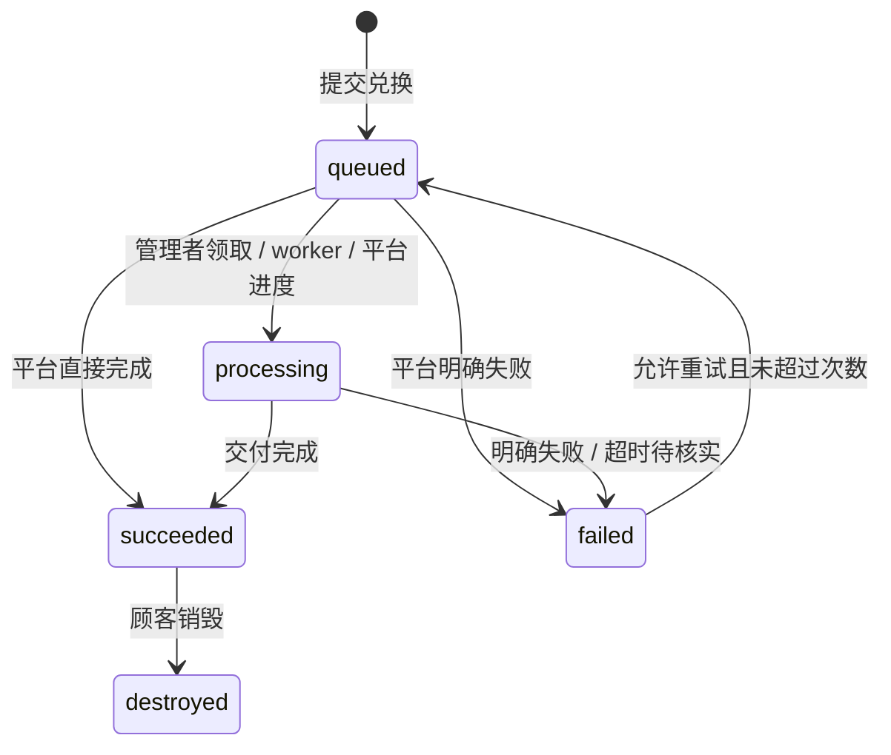

# 协议 v1

所有 JSON 使用 UTF-8。API 错误为 `{"detail":"说明"}`，HTTP 400/422 是输入错误，401/403 是认证或权限，404 是不存在，409 是状态冲突，410 是领取已失效，429 是限流。外部平台不访问商家会话接口。

## 任务状态



任务 ID 在重试时保持不变，`attempt` 从 1 递增。平台必须以稳定任务 ID 去重外部交付，以 `(task_id, attempt)` 区分状态回调。旧尝试的回调 HTTP 409。终态不能覆盖；同一终态的重复完成请求返回当前结果，不修改内容。只接受 0–100 的进度；处理中进度不能倒退，成功强制为 100。

商品规则 `allow_retry`、`max_attempts` 与失败结果 `retryable` 必须同时满足，才能重试。没有确认未交付的失败不能标记为可重试。Webhook 或队列超过 1 小时未更新，以及自动处理器中断，都会进入不可自动重试的失败状态；商家在核实后可放行。过期尝试的待投递 `redemption.requested` 会取消，不继续启动旧任务。

## 支付平台生成卡密

在 SSH 终端执行 `uv run python -m extore.cli integration-key`。命令生成或轮换仅能发行卡密的 API Key，只显示一次；与商品 Webhook 密钥无关。

```http
POST /api/integrations/cards
Authorization: Bearer <API-Key>
Idempotency-Key: payment-order-unique-id
Content-Type: application/json

{"product_id":"商品 UUID","count":1}
```

响应 `{"codes":["XXXXXXXX-XXXXXXXX-XXXXXXXX-XXXXXXXX"]}`。数量 1–1000。幂等键长 8–200 字符。同键同请求返回原卡密，不再生成；同键不同请求 HTTP 409。响应加密持久化用于平台恢复，密钥位于 `EXTORE_DATA/issuance.key`；该接口持钥者可读取同幂等键原响应，不向顾客暴露该密钥。幂等记录永久保留，防止旧订单重新发行。轮换平台 Key 不清理记录。

发行请求也可传 `label` 批次名称（最多 100 字符）和 `expires`（未来的 Unix 秒，省略或 `null` 表示不到期）。它们同样参与幂等请求匹配；已有未带这些字段的请求保持兼容。

平台须持久化订单与请求幂等键，收到响应后再向顾客交付卡密。没有付款回调或支付逻辑。

## 卡密库存与统计

商家可使用 `/api/admin` 或 `/api/manage` 下的查询接口查看全店或指定商品；商品管理链接使用 `/api/manage`，需要 `cards.manage`，且始终限定自己的商品。与其他商品管理接口不同，这些统计查询允许商家省略 `product_id` 查看全店。

| 接口 | 查询参数 | 结果 |
|---|---|---|
| `GET /api/manage/card-stats` | 可选 `product_id` | `{summary,products}`，总计与每个商品统计 |
| `GET /api/manage/card-inventory` | `product_id,status,batch_id,search,offset,limit` | `{items,total,summary,offset,limit}`，过滤库存与全范围统计 |
| `GET /api/manage/cards/{id}/history` | 可选 `product_id` | `{card,timeline}`，单张卡密状态与处理时间线 |

三个查询均有对应 `/api/admin/...` 接口。库存 `offset` 从 0 开始，`limit` 为 1–500；`search` 只匹配内部卡密 ID 或末 6 位。列表保留批次 ID 与名称、到期时间、首次验码时间、任务状态、尝试次数及领取记录，不返回完整卡密或摘要。旧卡没有可恢复的尾号时，`code_suffix` 为 `null`；尾号不保证唯一，内部 ID 才用于精确定位。

库存 `state` 保留原卡密生命周期值 `ready`、`reserved`、`used` 或 `revoked`；`status` 是结合任务与到期信息计算的展示状态，用于筛选。旧卡的批次、尾号与首次验码不会凭空回填；新验码记录从启用跟踪后开始，已有任务与领取记录仍计入统计。

统计口径：

| 字段 | 含义 |
|---|---|
| `total` | 已发行总数 |
| `remaining` | 尚未提交、未撤销且未过期的新库存 |
| `available` | 新库存加符合重试条件的原顾客卡密；可重试卡密不能当作新库存再次销售 |
| `used` | 已创建任务的卡密数，重试不重复计数 |
| `verified` | 已记录至少一次成功验码的卡密数 |
| `viewed` | 至少领取过一次内容的卡密数 |
| `in_progress` | 排队或处理中的卡密数 |
| `completed` | 已成功或已销毁的卡密数 |
| `failed` | 当前失败任务的卡密数 |

`summary.states` 的状态互斥：`unused`、`queued`、`processing`、`succeeded`、`failed_retryable`、`failed_terminal`、`destroyed`、`revoked`、`expired`，可作为库存 `status` 筛选值。库存响应的 `summary` 始终统计整个权限范围，不随状态、批次或搜索过滤改变；`total` 是筛选后的条数。

`expired` 表示未提交且已到期；失败任务到期后归入 `failed_terminal`。一次领取只增加领取记录，任务仍为 `succeeded`，不会自动变成 `destroyed`。

到期限制尚未兑换卡密的新提交和失败任务的重试；已经成功的交付仍按查看规则领取，到期不会销毁已有结果。历史包含发行、验码、提交、重试、进度、成功、失败、领取、销毁与撤销记录，不返回参数、消息、交付结果、私密领取链接、原卡密或摘要。

## 商品配置

`mode`: `manual` 表示队列，人或 AI 通过管理接口领取与处理；`webhook` 表示独立外部服务；`script` 是保留的内部代码名，表示官方白名单处理器。
`delivery`: `content` / `service`。
`view_policy`: `repeat` / `once`。
`public`: 首页是否公开显示商品。

队列商品用 `parameters` 定义顾客输入，用 `outputs` 定义交付结果。两者采用相同的字段描述，例如输入参数：

```json
{
  "key": "account_email",
  "label": {"zh-CN": "账户邮箱", "en": "Account email"},
  "type": "email",
  "required": true,
  "description": {"zh-CN": "## 查找邮箱\n1. 打开账户设置。\n2. 复制登录邮箱。"},
  "collapsed": true
}
```

输出字段示例：

```json
{
  "key": "resource_url",
  "label": {"zh-CN": "资源链接", "en": "Resource URL"},
  "type": "url",
  "required": true,
  "description": {"zh-CN": "打开链接领取你的资源。"},
  "collapsed": true
}
```

代码名匹配 `[a-z][a-z0-9_]{0,39}`，输入和输出各自唯一、各最多 30 个。类型支持 `text` / `email` / `url` / `textarea` / `number`，输入值最多 10000 字符。未知字段拒绝；服务端验证必填、邮箱、HTTP/HTTPS 链接与有限数字。字段名称和 Markdown 描述按当前语言展示，`collapsed` 决定教程默认折叠或展开。

内容商品必须有输出字段。省略 `outputs` 时默认一个必填的 `content` 文本字段，兼容旧商品。服务商品 `delivery="service"` 必须使用 `outputs=[]`，仅返回状态，不产生交付内容。

发过卡密的商品不能改变处理方式、交付类型、查看规则、处理器 ID、签名密钥，以及输入输出的代码名、类型或必填规则。需要改这些设置时创建新商品。队列和 Webhook 商品仍可改善字段名称、Markdown 描述与折叠偏好；官方处理器的字段由代码定义，不能自改。

## 官方自动处理器

处理器只能来自 [TokenNotIncluded/extore-processors](https://github.com/TokenNotIncluded/extore-processors) 的白名单目录。`processors/official` 由主仓库 Git 子模块记录固定提交，运行时按 `processor_id` 查找预设，不从任意仓库、文件路径或商家上传代码加载程序。商品的 `script` 字段为兼容保留，但必须为空。

`GET /api/admin/processors` 供商家查询预设；`GET /api/manage/processors` 需要 `product.edit`。每个预设包含 `id`、多语言名称与说明、`delivery`、`parameters`、`outputs` 和 `configuration`。商品通过 `processor_config` 填写配置；自动商品的顾客输入与交付输出必须与预设代码一致。

| `processor_id` | 商家配置 | 顾客输入 | 输出 |
|---|---|---|---|
| `resource_link` | 必填 HTTPS `resource_url`，可选 `message` | 无 | 必填资源链接、可选说明 |
| `personalized_text` | `template` 纯文本模板 | 必填 `name`，最多 200 字符 | `content` 文本 |

`resource_url` 最多 2000 字符，说明和模板最多 10000 字符。模板仅支持 `$name`、`${name}` 与 `$$` 文本替换，不执行代码。两个预设的配置均按秘密处理，顾客 API 不返回配置值。未完成配置的商品可保存为草稿，发行卡密和执行时必须满足全部必填配置。

升级官方处理器需审核源码与字段定义，再更新主仓库固定提交并发布程序包。固定的审核代码仍按 worker 用户权限运行，不提供任意恶意代码沙箱；其他自动化可以使用独立的 HTTPS 公网 Webhook 服务。

## Webhook 事件

商品配置 `webhook_url` 和 `webhook_secret`（至少 32 字符）。所有处理方式都可配置通知 URL；只有 `webhook` 处理方式接受外部状态回调。交付内容不写入事件；用户参数仅在 `redemption.requested` 携带。

```json
{
  "id": "事件 UUID",
  "type": "redemption.requested",
  "version": 1,
  "created_at": 1790000000.0,
  "product_id": "商品 UUID",
  "data": {
    "id": "任务 UUID",
    "state": "queued",
    "attempt": 1,
    "progress": 0,
    "message": "",
    "params": {"account_email": "user@example.com"}
  }
}
```

完整事件：

| type | 触发时机 | data |
|---|---|---|
| `redemption.requested` | 首次提交或合规重试 | 任务状态字段及 `params` |
| `fulfillment.progress` | 领取任务、自动处理开始、进度更新 | 任务状态字段 |
| `fulfillment.succeeded` | 首次成功交付 | 任务状态字段 |
| `fulfillment.failed` | 明确失败、超时或中断 | 任务状态字段 |
| `delivery.viewed` | 内容成功领取，每次重复查看也产生事件 | 任务状态字段 |
| `delivery.destroyed` | 顾客首次销毁 | 任务状态字段，`state=destroyed` |

事件与任务变更同一 SQLite 事务提交。外部平台应快速校验、入队并返回 2xx；随后异步执行。签名字段：

```text
X-Extore-Timestamp: Unix 秒
X-Extore-Nonce: 随机字符串
X-Extore-Signature: HMAC-SHA256 十六进制
X-Extore-Event-Id: 事件 UUID
Content-Type: application/json
```

签名输入为 `timestamp + "." + nonce + "." + 原始请求体字节`，密钥为商品的 `webhook_secret`。必须对原始字节验签，不得将 JSON 重编码后验签。允许时钟误差 ±300 秒；服务器需要正确同步时间。

投递保证为**至少一次**。重试使用相同事件 ID、新时间和新 nonce。接收端需持久化事件 ID 防止重复消费；SDK 只验签，不替你存储去重状态。一次 HTTP 投递 15 秒超时，最多 8 次，间隔 `min(3600, 2^attempts * 5)` 秒。只认可 2xx，不跟随重定向。投递失败记为 `dead` 后由商家重投；过期请求记为 `cancelled`。

不同任务不保证全局顺序；顾客状态以 API 为准。超时重试可能重复到达，另一平台必须以任务 ID 做发货去重，不能只依赖事件 ID。收到了非 `redemption.requested` 的通知时不要启动发货。

## 签名回调

```http
POST /api/callbacks/<product_id>/<task_id>
X-Extore-Timestamp: ...
X-Extore-Nonce: ...
X-Extore-Signature: ...
Content-Type: application/json
```

```json
{
  "attempt": 1,
  "state": "succeeded",
  "progress": 100,
  "message": "已完成",
  "output": {"resource_url": "https://downloads.example.com/receipt"},
  "retryable": false
}
```

`state` 可为 `processing` / `succeeded` / `failed`。成功交付使用 `output` 对象，键是商品 `outputs` 的代码名，值必须为字符串。未知字段、缺少必填值或类型不符返回输入错误；所有输出值合计最多 100000 字符。文本保留格式，邮箱、数字和 URL 去除两端空白；URL 只允许不含用户名和密码的 HTTP/HTTPS 地址。

旧 `content` 仅兼容只有一个 `content` 输出字段的商品。同时提供 `content` 和 `output` 时必须一致。服务商品不接受非空 `output`，兼容旧请求时忽略 `content`，只保留状态。`message` 最多 1000 字符，不能用它代替私密交付结果。

签名算法与事件相同。服务器持久化 nonce，在有效签名时间窗口内拒绝重放；相同 nonce 再到达 HTTP 409。商品不能跨商品更新任务，旧 attempt 或已销毁任务返回 409。签名不依赖浏览器 Origin 或 Cookie。

## 顾客接口

顾客浏览器的写入请求需要配置的 `Origin`，防止跨站操作。

| 接口 | 请求 | 结果 |
|---|---|---|
| `GET /api/products` | 无 | 仅公开商品及输入输出说明，无处理器秘密配置和密钥 |
| `POST /api/exchange` | `{code}` | 30 天兑换凭证、指定商品、已有任务 |
| `POST /api/redeem` | `{token,params}` | 创建或合规重试任务，返回状态 |
| `POST /api/receipt` | `{token}` | 商品与状态，不返回私密交付结果 |
| `POST /api/receipt/reveal` | `{token}` | 显式领取 `{output,content}`；`content` 为兼容可读文本，一次领取原子消费 |
| `POST /api/receipt/destroy` | `{token}` | 永久关闭应用内交付内容 |

不能根据商品 UUID 直接打开非公开商品。兑换凭证、商品管理链接和卡密都是秘密，不记录在分析工具中，不植入第三方前端脚本。状态、任务列表与事件不自动返回私密结果。一次领取或销毁会同时清除结构化 `output` 和兼容 `content`，后续不能再次领取；销毁只关闭 Extore 内的领取，不撤销上游资源链接。

## 商家接口

商家完整接口可在 `/docs` 查看。认证 Cookie HttpOnly、SameSite=Strict、生产 Secure；写操作校验 Origin。

商家可创建与维护商品、批量制卡、撤销未兑换卡密、维护商品管理链接、查看与重投事件，以及管理多个 Passkey。第一次注册 Passkey 后密码登录禁用；添加或移除 Passkey 需要最近 10 分钟内登录，最后一个 Passkey 不能从网页删除。全部遗失时通过 SSH 的 `reset-auth` 命令恢复。

`GET /api/admin/product-templates` 返回队列内容交付与队列服务模板。`POST /api/admin/products/quick` 接受 `{template_id,name?,from_product_id?}`：`template_id` 为 `manual_content`、`manual_service` 或 `existing_product`，复制已有商品时必须提供 `from_product_id`。响应 `{product,management_link}` 创建非公开商品及有效 7 天的配置链接，权限仅为 `product.edit` 与 `fulfillment.configure`，可交给 AI 或其他配置管理者。复制商品会更换签名密钥并移除原处理器秘密配置，不复制源商品的发货凭证。

## 商品管理链接

一个链接只授权一个商品。店长、处理人员等名称用于区分管理者，权限由链接的 `permissions` 决定。最大权限是该商品的全部管理权限，不包括创建其他商品、全店设置、支付平台 Key、商家认证或 Passkey 管理。

| 权限 | 允许的操作 |
|---|---|
| `queue.view` | 查看该商品任务、参数和处理进度 |
| `queue.process` | 人或 AI 领取队列任务，更新、完成或标记自己领取的任务失败；须同时有 `queue.view` |
| `queue.retry` | 核实失败任务后放行重试；须同时有 `queue.view` |
| `product.edit` | 查看与编辑商品展示信息和顾客参数；单独授予时不能读取签名密钥或更改发货、查看与重试规则 |
| `fulfillment.configure` | 读取与配置该商品发货方式、输出结构、查看与重试规则、官方处理器和签名密钥；须同时有 `product.edit` |
| `cards.manage` | 为该商品生成卡密、查看卡密状态、撤销未兑换卡密 |
| `events.manage` | 查看与重投该商品事件 |
| `links.delegate` | 为该商品生成更小权限的链接，查看与撤销自己的后代链接 |

全部八项权限用于店长管理指定商品。默认权限和升级前已有链接的权限为 `["queue.view","queue.process"]`，不会自动扩大。未知权限、空权限列表、处理或重试权限缺少 `queue.view`，以及自动发货配置权限缺少 `product.edit`，都返回 422。

`fulfillment.configure` 可以读取 Webhook 签名密钥。对于采用 Webhook 处理的商品，持有该密钥可以向系统提交该商品的签名回调。因此，此权限具有控制该商品外部发货的能力，不能只因为需要编辑商品展示就授予。队列操作仍单独校验 `queue.process` 与 `queue.retry`。

持有 `links.delegate` 的管理者可以创建子链接，限制如下：

- 商品必须与父链接相同。
- 子链接权限必须是父链接权限的**严格子集**，不能相同或增加。是否允许子链接继续委派，由是否保留 `links.delegate` 决定。
- 有效期不能超过父链接或任何祖先。父链接撤销或过期时，所有后代都失效，已登录会话也不能继续操作。
- 管理者只能查看和撤销自己的后代，不能撤销父链接或其他分支。撤销会级联撤销后代，并把它们尚在处理的任务放回原商品队列。

登录使用链接片段中的凭证提交 `POST /api/staff/login`，请求为 `{token}`。`/staff`、`/api/admin/staff` 和认证角色 `staff` 为兼容保留，界面统一称为商品管理链接。原始链接只在创建时返回，列表不包含凭证或数据库摘要。

`GET /api/auth/status` 的链接会话返回 `role="staff"`、`product_id`、`permissions`、`link_id`、`link_name`、`link_expires` 和 `parent_id`。`link_expires` 是当前链接与全部祖先中最早的到期时间，使用 Unix 秒。权限与祖先有效性在每次操作时重新校验，不能只信任前端缓存的认证状态。

商家创建店长链接：

```http
POST /api/manage/links
Content-Type: application/json

{
  "product_id": "商品 UUID",
  "name": "店长",
  "days": 7,
  "permissions": ["queue.view", "queue.process", "queue.retry", "product.edit", "fulfillment.configure", "cards.manage", "events.manage", "links.delegate"]
}
```

店长使用同一接口生成处理人员链接，商品可省略，由当前链接确定：

```json
{"name":"资料处理","days":1,"permissions":["queue.view","queue.process"]}
```

`name` 长 1–100 字符；`days` 为大于 0、最多 90 的天数，可使用小数。商家省略 `days` 时有效 7 天；下级省略时为 7 天与父链接剩余有效期的较短者。显式期限超过父链接、权限相同或扩大，均返回 403。`permissions` 省略时使用默认的队列查看与处理权限，重复权限会去重。

创建响应包含 `id`、`product_id`、`name`、`permissions`、`parent_id`、`created`、`expires`、`revoked` 和一次性返回的 `url`。列表省略 `url`。撤销返回 `{ok:true,revoked_count}`，数量包括被撤销的链接及后代。商家兼容接口 `POST /api/admin/staff` 使用相同创建字段，但 `product_id` 必填；`GET /api/admin/staff` 查看全店管理链接，`POST /api/admin/staff/{id}/revoke` 撤销指定分支。

## 按商品管理接口

以下接口同时供商家和商品管理链接使用。GET、PUT 与路径撤销/重投接口用查询参数 `product_id` 选择商品：商家必须指定，链接持有人可省略并默认自己的商品；指定其他商品返回 403。`GET /api/manage/products` 返回最小商品概要，不需要队列查看权限。

| 接口 | 权限 | 请求与结果 |
|---|---|---|
| `GET /api/manage/products` | 有效管理会话 | 授权商品概要及交付输出定义 |
| `GET /api/manage/processors` | `product.edit` | 官方处理器预设与其代码定义的输入输出、配置项 |
| `GET /api/manage/product` | `product.edit` | 当前商品配置；没有 `fulfillment.configure` 时签名密钥与处理器秘密配置隐藏 |
| `PUT /api/manage/product` | `product.edit` | JSON 为商品配置；`product_id` 在查询参数，不放入 JSON；发货配置还需 `fulfillment.configure`，响应按 GET 的规则隐藏密钥 |
| `GET /api/manage/cards` | `cards.manage` | 卡密 ID、商品、状态与创建时间；不返回原卡密或摘要 |
| `POST /api/manage/cards` | `cards.manage` | `{product_id,count,label?,expires?}`；商品必填，数量 1–1000，默认 1；返回 `{codes,batch_id}` |
| `POST /api/manage/cards/{id}/revoke` | `cards.manage` | 仅撤销当前商品尚未兑换的卡密 |
| `GET /api/manage/events` | `events.manage` | 当前商品的事件及投递状态，不含完整参数、内容或签名密钥 |
| `POST /api/manage/events/{id}/retry` | `events.manage` | 仅重投当前商品 `dead` 的事件 |
| `GET /api/manage/links` | `links.delegate` | 商家查看当前商品全部链接；管理者只查看自己的后代 |
| `POST /api/manage/links` | `links.delegate` | `{product_id?,name,days?,permissions?}`；创建同商品的更小权限链接 |
| `POST /api/manage/links/{id}/revoke` | `links.delegate` | 级联撤销当前商品内有权管理的链接分支 |

商品更新时，`webhook_secret` 留空表示保留原值，合并后再验证完整配置。没有 `fulfillment.configure` 的管理者提交隐藏的空处理器配置时保留原值，不能更改 `mode`、`delivery`、`view_policy`、`script`、`webhook_url`、`webhook_secret`、`allow_retry`、`max_attempts`、`processor_id`、`processor_config` 或输出字段结构，修改返回 403。拥有此权限仍受前文的已发卡冻结与官方预设限制。商品管理链接不能安装程序、创建新商品或调用全店 `/api/admin/*` 接口。

商家 `POST /api/admin/cards` 同样返回 `{codes,batch_id}`，用于定位本次发行的批次；支付平台制卡接口保持 `{codes}` 响应。

## 商品队列

队列按商品分开。`GET /api/manage/products` 返回有权管理的商品概要；商品管理链接只得到授权商品。商家查询 `GET /api/manage/jobs?product_id=<商品 UUID>` 必须指定商品，链接持有人可省略并默认使用授权商品；查看队列需要 `queue.view`。排队顺序和前方任务数量在商品内独立计算。

`POST /api/manage/batch`：

```json
{"product_id":"商品 UUID","ids":["任务 UUID"],"action":"progress","progress":50,"message":"资料审核完成"}
```

`action`: `claim` / `progress` / `succeed` / `fail` / `retry`。`product_id` 必填，一次最多 100 个同商品任务，混入其他商品返回 403 且整批回滚。整批事务要么成功、要么回滚。`claim`、`progress`、`succeed` 与 `fail` 需要 `queue.process`；领取只接受排队任务，进度、完成和失败只接受当前管理者自己领取的队列任务。人和 AI 使用相同接口与权限。`retry` 需要 `queue.retry`，核实后允许失败任务由顾客再次提交。官方处理器和 Webhook 任务不能由队列接口覆盖交付。

完成使用 `action="succeed"` 与符合商品输出结构的 `output`：

```json
{"product_id":"商品 UUID","ids":["任务 UUID"],"action":"succeed","output":{"resource_url":"https://downloads.example.com/receipt"},"message":"已完成"}
```

同一批任务使用同一组结果；需要分别交付不同结果时分别提交。服务商品完成不提供输出内容。

事件记录不含完整参数和交付内容，审计记录保存操作者、动作、目标及时间。敏感内容的完整备份、保留期和外部平台删除策略需由商家制定。
